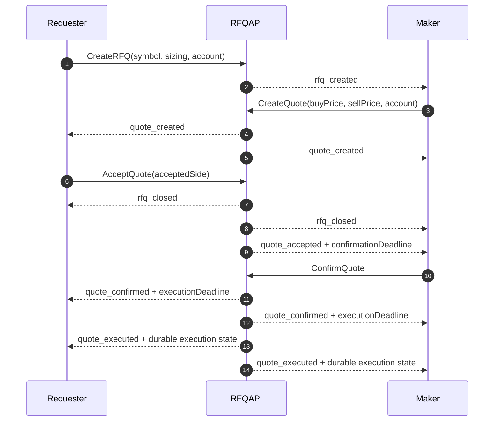

> ## Documentation Index
> Fetch the complete documentation index at: https://docs.polymarket.us/llms.txt
> Use this file to discover all available pages before exploring further.

# RFQ API Overview

> Create and manage combo RFQs and quotes

<Info>
  Market makers should read the [Combos guide](/trader-guide/combos) before integrating. It explains quote construction, visibility, last look, and recovery.
</Info>

The public `polymarket.v1.RFQAPI` gRPC service creates, reads, and manages combo RFQs and quotes. An RFQ references the exact symbol of a [combo instrument](/institutional/combos/overview). The service also exposes the gRPC-only RFQ event stream.

Every REST endpoint below has an equivalent unary gRPC RPC. REST JSON uses lower camel case; protobuf fields use snake case.

## Endpoints

| Method   | Endpoint                                    | Scope          | Per-firm limit            | Description                                |
| -------- | ------------------------------------------- | -------------- | ------------------------- | ------------------------------------------ |
| `GET`    | `/v1/rfqs/user-id`                          | `read:orders`  | 1 req/sec                 | Get your pseudonymous RFQ user ID          |
| `GET`    | `/v1/rfqs`                                  | `read:orders`  | 10 req/sec                | Query RFQs                                 |
| `POST`   | `/v1/rfqs`                                  | `write:orders` | 1 req/sec                 | Create an RFQ                              |
| `DELETE` | `/v1/rfqs/{rfqId}`                          | `write:orders` | 100 req/sec               | Close an open RFQ                          |
| `GET`    | `/v1/rfqs/quotes`                           | `read:orders`  | 10 req/sec                | Query visible quotes                       |
| `POST`   | `/v1/rfqs/quotes`                           | `write:orders` | 400–2,000 req/sec by tier | Create or replace your quote for an RFQ    |
| `DELETE` | `/v1/rfqs/{rfqId}/quotes/{quoteId}`         | `write:orders` | 400–2,000 req/sec by tier | Delete your quote                          |
| `PUT`    | `/v1/rfqs/{rfqId}/quotes/{quoteId}/accept`  | `write:orders` | 100 req/sec               | Accept one side of a quote                 |
| `PUT`    | `/v1/rfqs/{rfqId}/quotes/{quoteId}/confirm` | `write:orders` | 100 req/sec               | Confirm an accepted quote during last look |

All calls require bearer-token authentication and an acting participant, supplied through `x-participant-id` or the token's `participant_id` claim.

Each unary method has a separate per-firm rate-limit bucket with one second of burst capacity, shared across REST and gRPC requests. Your RFQ tier determines the `CreateQuote` and `DeleteQuote` limits. See [RFQ rate-limit tiers](/trader-guide/rate-limits#rfq-rate-limit-tiers) for rates and eligibility requirements.

Opening `StreamRFQEvents` is limited to one new stream per second per firm. See [Rate Limits](/trader-guide/rate-limits#rfq-endpoints).

## RFQ Lifecycle



Successful `AcceptQuote` produces both `rfq_closed` and `quote_accepted`. A client may receive the public `rfq_closed` event first. Stop creating or replacing quotes for that RFQ, but keep existing quote state until the private quote event arrives or `GetQuotes` confirms its current status.

## Create an RFQ

`POST /v1/rfqs`

```json theme={null}
{
  "cashOrderQty": "10.0000",
  "symbol": "caoc-...",
  "restRemainder": false,
  "account": "firm/account"
}
```

| Field           | Required         | Description                                                                                    |
| --------------- | ---------------- | ---------------------------------------------------------------------------------------------- |
| `qtyDecimal`    | One sizing field | Exact contract quantity. Mutually exclusive with `cashOrderQty`.                               |
| `cashOrderQty`  | One sizing field | Positive cash notional with at most four decimal places. Mutually exclusive with `qtyDecimal`. |
| `symbol`        | Yes              | Existing open and tradable combo symbol.                                                       |
| `restRemainder` | Yes              | Whether an unfilled requester remainder may rest after paired order submission.                |
| `account`       | Yes              | Requester's fully qualified trading account.                                                   |

The response contains the new `rfqId`. A created RFQ starts in `RFQ_STATUS_OPEN`.

## Query RFQs

`GET /v1/rfqs?limit=10&status=RFQ_STATUS_OPEN`

| Parameter    | Description                                                  |
| ------------ | ------------------------------------------------------------ |
| `limit`      | Results per page. Default 100; valid range 1–100.            |
| `cursor`     | Opaque cursor returned by the preceding page.                |
| `rfqId`      | Exact RFQ ID. Do not combine an exact-ID read with `cursor`. |
| `symbol`     | Exact combo symbol.                                          |
| `status`     | `RFQ_STATUS_OPEN` or `RFQ_STATUS_CLOSED`.                    |
| `userFilter` | `USER_FILTER_SELF` returns RFQs created by the caller.       |

The response has `rfqs` and an opaque `cursor`. An exact RFQ ID that is absent or not visible returns an empty `rfqs` array.

Each RFQ includes the combo's ordered leg snapshot and optional price tick:

```json theme={null}
{
  "id": "rfq_...",
  "symbol": "caoc-...",
  "status": "RFQ_STATUS_OPEN",
  "tickSize": 0.001,
  "comboLegs": [
    {
      "symbol": "market-a",
      "side": "SIDE_BUY",
      "settlementPrice": "0.4"
    },
    {
      "symbol": "market-b",
      "side": "SIDE_SELL",
      "settlementPrice": "0"
    }
  ]
}
```

`tickSize` is the instrument's minimum price increment in dollars (`tick_size` in protobuf). Quote prices must be multiples of this value and within the instrument's price limits. It is also included in `rfq_created` and `rfq_closed` events.

If `tickSize` is absent, read it from `GET /v1/combos?symbol=<rfq.symbol>`.

| Leg field         | Description                                             |
| ----------------- | ------------------------------------------------------- |
| `symbol`          | Component instrument symbol.                            |
| `side`            | Component side in the combo: `SIDE_BUY` or `SIDE_SELL`. |
| `settlementPrice` | Optional raw YES/LONG settlement normalized to `[0,1]`. |

`settlementPrice` is a canonical decimal string such as `"0"`, `"0.4"`, or `"1"`. It is not inverted for `SIDE_SELL` legs. An absent field means no valid settlement is currently available; it is distinct from a present `"0"`. Treat absence as unavailable, not proof that the leg is unresolved.

Leg order and sides are fixed when the RFQ is created. Settlement prices are hydrated when the RFQ is returned, so later exact and list reads can expose settlements that were unavailable at creation. Historical RFQs created before leg snapshots were introduced can have an empty `comboLegs` array.

## Close an RFQ

`DELETE /v1/rfqs/{rfqId}` closes an open RFQ. Only its requester can close it. The response is `{}`.

## Quotes

A quote can offer both requester sides:

* `buyPrice` is the price for a requester buy; the maker sells.
* `sellPrice` is the price for a requester sell; the maker buys.

Set an unavailable side to `"0"`. At least one side must be positive. Nonzero prices must be within the instrument's price limits and land on its tick size.

### Create or Replace a Quote

`POST /v1/rfqs/quotes`

```json theme={null}
{
  "rfqId": "rfq_...",
  "buyPrice": "0.615",
  "sellPrice": "0.585",
  "restRemainder": false,
  "postOnly": true,
  "account": "firm/account"
}
```

| Field           | Required | Description                                                                       |
| --------------- | -------- | --------------------------------------------------------------------------------- |
| `rfqId`         | Yes      | Open RFQ to quote.                                                                |
| `buyPrice`      | Yes      | Requester-buy price, or `"0"` if unavailable.                                     |
| `sellPrice`     | Yes      | Requester-sell price, or `"0"` if unavailable.                                    |
| `restRemainder` | Yes      | Whether the maker order may rest after paired order submission.                   |
| `postOnly`      | No       | If true, submit the maker order as participate-don't-initiate. Defaults to false. |
| `account`       | Yes      | Maker's fully qualified trading account.                                          |

The service derives `buyQtyDecimal` and `sellQtyDecimal` from the RFQ:

* A quantity RFQ uses its `qtyDecimal` for every offered side.
* A cash RFQ derives each side independently from `cashOrderQty / price`, rounded down to the instrument's fractional quantity scale.

Each maker has one deterministic quote ID per RFQ. Calling `CreateQuote` again replaces that maker's quote in place, resets it to `QUOTE_STATUS_ACTIVE`, and returns the same `quoteId`.

### Query Quotes

`GET /v1/rfqs/quotes?rfqId=rfq_...`

| Parameter       | Description                                                                           |
| --------------- | ------------------------------------------------------------------------------------- |
| `limit`         | Results per page. Default 100; valid range 1–100.                                     |
| `cursor`        | Opaque cursor returned by the preceding page.                                         |
| `quoteId`       | Exact quote ID. Requires `rfqId`; do not combine with `cursor`.                       |
| `rfqId`         | Exact RFQ ID. The requester sees all quotes; another participant sees only its quote. |
| `status`        | One current `QuoteStatus` value.                                                      |
| `userFilter`    | `USER_FILTER_SELF` returns quotes created by the caller.                              |
| `rfqUserFilter` | `USER_FILTER_SELF` returns quotes on RFQs created by the caller.                      |

Without `rfqId`, provide exactly one of `userFilter=USER_FILTER_SELF` or `rfqUserFilter=USER_FILTER_SELF`. The response has `quotes` and an opaque `cursor`.

Each visible `Quote` carries durable execution state once available:

| REST JSON field     | Description                             |
| ------------------- | --------------------------------------- |
| `executionDeadline` | Scheduled paired-order submission time. |
| `executedTime`      | Durable execution-state timestamp.      |
| `rfqCreatorOrderId` | Optional requester exchange order ID.   |
| `creatorOrderId`    | Optional quoter exchange order ID.      |

The requester and quoter can both see both exchange order IDs. A `Quote` does not expose client order IDs. `GetQuotes` is the durable recovery path when a stream event is missed.

For compatibility, stream events retain their existing recipient-specific wrapper fields. The embedded `Quote` contains the durable fields above.

<Warning>
  Cursors are query-, participant-, and path-bound. Treat them as opaque and reuse them only with the same filters and authenticated participant.
</Warning>

### Accept a Quote

`PUT /v1/rfqs/{rfqId}/quotes/{quoteId}/accept`

```json theme={null}
{
  "acceptedSide": "SIDE_BUY"
}
```

Only the requester can accept an active quote. `SIDE_BUY` selects `buyPrice`; `SIDE_SELL` selects `sellPrice`. The selected price must be positive. Acceptance closes the RFQ, emits public `rfq_closed`, changes the quote to `QUOTE_STATUS_ACCEPTED`, emits participant-private `quote_accepted`, and starts last look.

### Delete a Quote

`DELETE /v1/rfqs/{rfqId}/quotes/{quoteId}` deletes the caller's active quote while the RFQ is open. The selected maker can also delete its accepted quote before the confirmation deadline to decline during last look. The response is `{}`.

### Confirm a Quote

`PUT /v1/rfqs/{rfqId}/quotes/{quoteId}/confirm`

The selected maker must confirm before `confirmationDeadline`. Confirmation changes the quote to `QUOTE_STATUS_CONFIRMED` and schedules paired order submission. The response is `{}`.

## Statuses

| Type  | Status                   | Meaning                                                                               |
| ----- | ------------------------ | ------------------------------------------------------------------------------------- |
| RFQ   | `RFQ_STATUS_OPEN`        | Can receive and accept quotes.                                                        |
| RFQ   | `RFQ_STATUS_CLOSED`      | Closed by the requester or by quote acceptance.                                       |
| Quote | `QUOTE_STATUS_ACTIVE`    | Can be accepted while its RFQ is open.                                                |
| Quote | `QUOTE_STATUS_ACCEPTED`  | Selected; maker last look is active.                                                  |
| Quote | `QUOTE_STATUS_CONFIRMED` | Maker confirmed; paired order submission is scheduled or needs reconciliation.        |
| Quote | `QUOTE_STATUS_DELETED`   | Maker deleted or declined the quote.                                                  |
| Quote | `QUOTE_STATUS_EXECUTED`  | Both exchange orders were accepted for submission. Reconcile fills through Drop Copy. |

## Events and Recovery

`RFQAPI.StreamRFQEvents` is a live, best-effort gRPC stream. Public RFQ events are visible to participants; quote events are private to the requester and relevant maker. The stream has no replay, gap-free handoff, ordering, or deduplication guarantee.

Open the stream for low-latency changes. On startup, reconnect, or after a suspected missed event, reconcile durable state with `GetRFQs` and `GetQuotes`. See [RFQ Events Stream](/streaming-endpoints/rfq-events-stream).

## See Also

<CardGroup cols={2}>
  <Card title="Combos API" icon="shuffle" href="/institutional/combos/overview">
    Create and read combo instruments
  </Card>

  <Card title="Combos Guide" icon="shuffle" href="/trader-guide/combos">
    Maker workflow and quote rules
  </Card>

  <Card title="RFQ Events Stream" icon="bolt" href="/streaming-endpoints/rfq-events-stream">
    Current event payloads and recovery behavior
  </Card>

  <Card title="Authentication" icon="key" href="/trader-guide/authentication#api-scopes">
    OAuth metadata and required scopes
  </Card>
</CardGroup>
