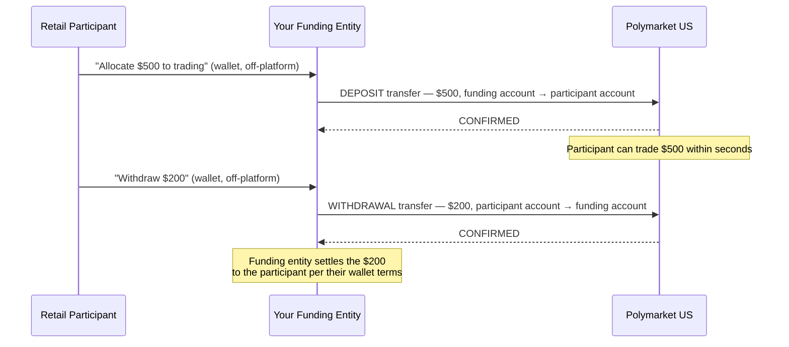

> ## Documentation Index
> Fetch the complete documentation index at: https://docs.polymarket.us/llms.txt
> Use this file to discover all available pages before exploring further.

# Deposits & Withdrawals

> Mirroring wallet allocations into on-platform buying power with deposit and withdrawal transfers.

<Warning>
  **BETA — SUBJECT TO CHANGE.** This capability is in beta and may change without notice.
</Warning>

A participant's buying power at Polymarket US is the cash in their trading account. Your funding entity manages that cash with two [transfer](/partners/funding/transfers) reasons — **`DEPOSIT`** (partner funding account → participant account) and **`WITHDRAWAL`** (participant account → funding account) — mirroring what the participant does in their wallet:



**Why this beats bank rails:** the participant's fiat already sits with your funding entity. Allocating it to trading is one platform ledger transfer — seconds — instead of a bank transfer to the clearinghouse — hours to days. The time between *"I want to trade with these funds"* and *"I can submit a trade with these funds"* is one confirmed `DEPOSIT` transfer.

## Deposits

Create a `DEPOSIT` transfer when the participant allocates wallet funds to trading:

* **Event-driven, typically 1:1.** One transfer per wallet allocation event is the intended pattern. If wallet deposits and withdrawals are the only ways a participant's allocation changes, mirroring them keeps on-platform buying power in lock-step with the wallet.
* **Latency-sensitive.** A participant is typically waiting to trade behind a deposit. Give deposits priority over batch work (fee collections, scheduled withdrawals) in your transfer queue — see [rate limits and smoothing](/partners/funding/transfers#rate-limits-and-smoothing).
* **Funded from the pool.** A deposit is rejected if the partner funding account can't cover it — size and top up the pool for peak allocation demand, per [sizing the funding account](/partners/funding/overview#sizing-the-funding-account).
* **Consider batching micro-events.** If your product produces many small allocations per participant (e.g. round-ups), aggregate them into fewer, larger deposits rather than one transfer each — transfers scale with wallet events, and the [budget](/partners/funding/overview#the-transfer-budget) is shared across your integration.

## Withdrawals

Create a `WITHDRAWAL` transfer when the participant de-allocates funds from trading. The amount must be covered by the participant's **free cash**:

```
free cash = account cash − collateral locked by open orders and positions
```

* **Check before you initiate.** Confirm free cash via your ledger projection (authoritative read: `PositionAPI/GetAccountBalance` — see [Reconciliation](/partners/reconciliation#cash-balances-polymarket-v1-positionapi)). A withdrawal exceeding free cash is [rejected](/partners/funding/transfers#insufficient-funds).
* **Leave the fee earmark behind.** Accrued, uncollected vendor fees are cash in the same account. Cap withdrawable amount at `free cash − accrued uncollected vendor fees`, or your fee collection becomes uncollectable — see [Vendor Fees](/partners/funding/vendor-fees#accrued-fees-are-credit-exposure).
* **Open orders lock collateral.** If the participant wants to withdraw more than their free cash, they (or you, on their behalf) must first cancel open orders or close positions to release collateral.
* **Trading proceeds are withdrawable.** Settlement credits, realized profit, and released collateral accumulate in the account as free cash — a participant "cashing out winnings" is just a withdrawal like any other.

## Keeping the mirror honest

Both legs of every confirmed transfer post to the [balance ledger](/streaming-endpoints/balance-ledger-stream) as typed entries (`DEPOSIT` / `WITHDRAWAL`), alongside trading events. Reconcile per account:

```
account cash = Σ deposits − Σ withdrawals − Σ vendor fee collections
             − collateral locked ± realized P&L + settlement credits − exchange fees
```

Your funding entity's wallet ledger and the platform's account ledger should agree on the allocation at all times; the [Reconciliation](/partners/reconciliation) page covers the stream-first pattern for maintaining that projection across your participant base.

## Related pages

<CardGroup cols={2}>
  <Card title="Transfers" icon="right-left" href="/partners/funding/transfers">
    The API — request shape, idempotency, rate limits.
  </Card>

  <Card title="Partner Funding Overview" icon="building-columns" href="/partners/funding/overview">
    The model and the transfer budget.
  </Card>

  <Card title="Vendor Fees" icon="file-invoice-dollar" href="/partners/funding/vendor-fees">
    The fee earmark that withdrawals must respect.
  </Card>

  <Card title="Reconciliation" icon="scale-balanced" href="/partners/reconciliation">
    Ledger projection and authoritative balance reads.
  </Card>
</CardGroup>
