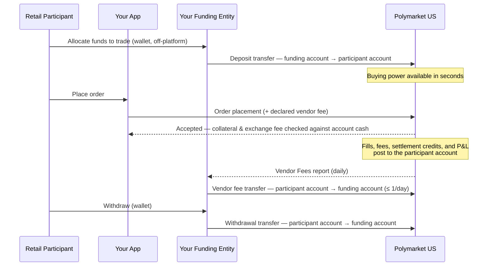

> ## Documentation Index
> Fetch the complete documentation index at: https://docs.polymarket.us/llms.txt
> Use this file to discover all available pages before exploring further.

# Partner Funding

> How participant trading accounts are funded — instant deposits from your funding entity's pre-positioned pool, order-time vendor fee declaration, and periodic fee collection.

<Warning>
  **BETA — SUBJECT TO CHANGE.** Partner funding is in beta, enabled per partner. Email **[institutional@polymarket.us](mailto:institutional@polymarket.us)** to discuss access for your integration.
</Warning>

Partner funding is the funding model for IB/ISV partners: your funding entity **pre-positions pooled funds** in a **partner funding account** at Polymarket US — the banking happens ahead of time. When a participant allocates funds to trade, your funding entity moves cash from that pool into their trading account with an instant **deposit transfer**; when they withdraw, cash moves back with a **withdrawal transfer**. Orders then trade against the cash in the participant's account like any other order — no money moves at order time.

Your **vendor fee** is *declared* on each order placement and recorded by Polymarket US, but it is **not** moved per order. Fees accrue as a receivable and are collected periodically — at most once per day — with a single **vendor fee transfer** per participant account, reconciled against a daily [Vendor Fees report](/partners/funding/vendor-fees).

<Note>
  Partner funding is available to **IB and ISV partners with a configured funding relationship** only. The service authenticates your partner firm and looks up your funding configuration; calls from firms without a funding relationship are rejected.
</Note>

## Why this model exists

**The problem is bank speed.** If every Retail Participant had to move cash from their bank into the clearinghouse before trading, fiat rails would set the pace of your product: a newly onboarded user couldn't place their first trade until their deposit cleared, and an existing user topping up would wait just as long between requesting a deposit and having funds available to trade. Bank transfers take hours to days; a trading opportunity doesn't.

**The solution is to keep the cash close.** Participant cash is custodied by your *funding entity* (typically the wallet provider affiliated with your firm), which maintains one pooled **partner funding account** at Polymarket US, pre-positioned ahead of trading. When a participant decides to trade, funding their account is an **instant ledger transfer** — pool → participant account, seconds not days. The time between *"I want to trade with these funds"* and *"I can submit a trade with these funds"* collapses to the time of one platform transfer.

**The structure follows the rules on who may hold customer funds.** Regulation constrains which intermediaries are permitted to hold customer funds — and an IB or ISV is not one of them. The model is designed around that constraint:

* The pooled funds are held by the **funding entity** — a separate legal entity in your corporate structure — not by your firm.
* Your firm is a pure **message facilitator**: you authenticate as the Firm, submit orders and transfer instructions on behalf of Retail Participants and your funding entity. Your firm's own identity never holds a balance.
* Money moves between exactly two places — the partner funding account and a participant account under your Firm — for exactly three reasons: **deposit**, **withdrawal**, and **vendor fee collection**. Any other movement is rejected by the platform. Every dollar has a typed, directional audit trail by design.

## The three parties

| Party                   | Role                                                                                                               | Holds funds at Polymarket US?         |
| ----------------------- | ------------------------------------------------------------------------------------------------------------------ | ------------------------------------- |
| **Retail Participant**  | The trader. Owns a trading account that holds their cash, order collateral, and positions.                         | Yes — their allocated trading balance |
| **Your firm (IB/ISV)**  | Message facilitator. Submits orders and transfer instructions on behalf of the participant and the funding entity. | **No — never**                        |
| **Your funding entity** | Separate legal entity that custodies participant cash off-platform and holds the **partner funding account**.      | Yes — the unallocated pool            |

The participant, your firm, and your funding entity coordinate through your product's UX and the legal agreements between the three parties. From the participant's point of view they allocate funds in their wallet and trade — your backend turns that into a deposit transfer and order placements.

## Getting set up

The structure is established once, coordinated with your Polymarket US integration lead during [partner onboarding](/partners/get-connected/onboarding):

1. **Create your funding entity** — a separate legal entity that will custody participant cash and hold the pooled funding account. Your firm cannot hold participant funds itself.
2. **Two onboardings, coordinated as one workflow** — your firm onboards as an access shell (holds no funds, no positions); your funding entity onboards as its own entity with an active, funded account. **Your funding entity must exist and be active before your firm's API credentials can be enabled.**
3. **Credentials linked to the funding account** — your firm's API credentials are provisioned against your funding entity's account. Every transfer you submit has the partner funding account as one side, enforced by the platform.
4. **Each participant gets a \$0 account** — provisioned automatically on KYC approval (see [Onboard Participants](/partners/onboarding/onboard-participants)). Accounts hold cash from their first deposit transfer onward.
5. **Three-party agreement in place** — participant, your firm, and your funding entity must have an agreement authorizing the deposits, withdrawals, and vendor fee collections.

<Info>
  The funding relationship is fixed per firm: a firm's participants are either all funded through the partner funding account or not — there is no per-participant mixing.
</Info>

## How money moves



| Flow                      | Direction                             | When                                    | Moved by                                                                                                                                     |
| ------------------------- | ------------------------------------- | --------------------------------------- | -------------------------------------------------------------------------------------------------------------------------------------------- |
| **Deposit**               | Funding account → participant account | Participant allocates funds to trade    | Your funding entity, via [transfer](/partners/funding/transfers)                                                                             |
| **Trading**               | Within the participant account        | Continuously                            | Polymarket US — collateral locks, exchange fees, fills, settlement credits, realized P\&L all post to the account                            |
| **Vendor fee accrual**    | *No movement*                         | Each order placement                    | Recorded only — Polymarket US stores your declared fee against the order                                                                     |
| **Vendor fee collection** | Participant account → funding account | Periodic, at most once per day          | Your funding entity, via [transfer](/partners/funding/transfers), reconciled against the [Vendor Fees report](/partners/funding/vendor-fees) |
| **Withdrawal**            | Participant account → funding account | Participant withdraws from their wallet | Your funding entity, via [transfer](/partners/funding/transfers)                                                                             |

**Trading proceeds stay put.** Settlement credits, realized profit, and released collateral remain in the participant's account — they *are* the participant's buying power for the next trade. Nothing needs to be swept after fills or settlements; cash only leaves an account for a withdrawal or a vendor fee collection.

## Buying power

Two numbers matter for every order, and they are owned by different systems:

| Check              | Owner                     | Formula                                                                                                              |
| ------------------ | ------------------------- | -------------------------------------------------------------------------------------------------------------------- |
| **Platform check** | Polymarket US             | An order is rejected unless the participant account's available cash covers **worst-case collateral + exchange fee** |
| **Your gate**      | You & your funding entity | Spendable balance = account cash − **accrued, uncollected vendor fees**                                              |

Polymarket US knows nothing about your fee basis and does not reserve for vendor fees — it only records the amounts you declare. Between collections, accrued fees are cash sitting in the participant's account that the participant could otherwise trade with. **Your platform must gate order submission off-platform** so a participant cannot spend the cash that is earmarked for your accrued fees. See [Vendor Fees](/partners/funding/vendor-fees) for the accrual model and the credit-risk consequences of not gating.

If deposits and withdrawals are the only balance events in your wallet product, mirroring them 1:1 with deposit and withdrawal transfers keeps on-platform buying power exactly in step with the participant's wallet allocation — see [Deposits & Withdrawals](/partners/funding/deposits-withdrawals).

## The transfer budget

Platform transfers are a **limited, shared resource — budget for 5 transfers per second** across your integration. The model is designed to fit comfortably inside that:

* **Deposits and withdrawals are event-driven** — typically one transfer per wallet deposit/withdrawal event per participant. No per-order movement.
* **Vendor fees are batched** — one transfer per participant account per collection period, **at most once per day** (weekly or monthly are fine too).
* **Trading itself uses zero transfers** — collateral, exchange fees, fills, and settlement all post inside the participant account.

Do not design flows that scale transfers with order volume, and smooth out bursts — for example, spread an end-of-day vendor fee collection run across minutes rather than firing one call per account simultaneously. See [Transfers](/partners/funding/transfers#rate-limits-and-smoothing) for concrete rate-limit handling patterns.

## Sizing the funding account

The partner funding account is the **unallocated pool** — participant trading balances live in their own accounts. Size the pool to cover expected **deposit demand** between top-ups from your funding entity's treasury: peak concurrent "allocate funds" flow, not open interest. A deposit transfer fails if the pool can't cover it.

Use `GetFundingAccountBalance` to read the authoritative, current pool balance on demand. The service resolves the partner funding account from your authenticated firm identity, so you do not supply an account ID. Poll at modest rates to monitor available capacity, and read the balance before or after treasury top-ups and large transfer batches when you need a current value.

A real-time mirror remains useful for alerting and reconciliation. Seed and periodically verify it with `GetFundingAccountBalance`, and investigate any drift from this identity:

```
pool balance = treasury top-ups (external)
             − Σ deposit transfers (out to participant accounts)
             + Σ withdrawal transfers (back in)
             + Σ vendor fee collections (back in)
```

The RPC is the source of truth when the mirror and the returned balance differ. See [GetFundingAccountBalance](/partners/funding/transfers#getfundingaccountbalance) for the request, response, and retry behavior.

### Deposits and withdrawals at the wallet

A participant's fiat deposits and withdrawals are movements between the participant and your funding entity — part of their wallet relationship, settled through your payment provider, entirely outside Polymarket US. What reaches Polymarket US is the allocation: when a participant designates wallet funds for trading, your funding entity mirrors that allocation onto the platform with a deposit transfer, and mirrors de-allocations back with withdrawal transfers.

## Directional guarantees

The platform enforces the money-flow rules at the API level. Your partner funding account is **always one side** of every transfer, and a participant account under your Firm is always the other:

| Money movement                                                                 | Reason        | Allowed?   |
| ------------------------------------------------------------------------------ | ------------- | ---------- |
| Funding account → participant account                                          | `DEPOSIT`     | ✅          |
| Participant account → funding account                                          | `WITHDRAWAL`  | ✅          |
| Participant account → funding account                                          | `VENDOR_FEES` | ✅          |
| Participant account → your firm, another participant, or any other destination | —             | ❌ Rejected |

This is what lets your firm operate without ever holding participant funds: you can only route money between the participant and the funding entity that custodies their wallet.

## API surface

The partner funding APIs are **gRPC-only**. Connection and authentication follow the standard conventions — TLS and a Bearer access token in the `authorization` metadata header; see the [gRPC API Overview](/grpc-api/overview) and [Authentication](/streaming-endpoints/authentication).

| Concern                                      | Service                                                               | Pages                                                                                     |
| -------------------------------------------- | --------------------------------------------------------------------- | ----------------------------------------------------------------------------------------- |
| Order placement with vendor fee declaration  | `polymarket.us.orderfunding.v1.OrderFundingService/CreateVendorOrder` | [Create Order](/partners/orders/create-order) · [Data Model](/partners/orders/data-model) |
| Deposits, withdrawals, vendor fee collection | `polymarket.us.cashmovement.v1.CashMovementService`                   | [Transfers](/partners/funding/transfers)                                                  |
| Fee accrual reporting                        | Daily Vendor Fees report                                              | [Vendor Fees](/partners/funding/vendor-fees)                                              |

<Warning>
  **Orders that carry a vendor fee must go through `OrderFundingService`.** It records your declared fee against the order and passes the order through to the exchange. Orders placed via generic order entry or FIX carry no vendor fee and accrue nothing.
</Warning>

## Reconciliation

Every cash event — deposits, withdrawals, vendor fee collections, fills, exchange fees, settlement credits — is visible on the account's cash ledger. Use the standard surfaces to keep your books and your funding entity's records in sync:

<CardGroup cols={3}>
  <Card title="Balance Ledger Stream" icon="scale-balanced" href="/streaming-endpoints/balance-ledger-stream">
    Real-time balance impact of every cash event, with replay.
  </Card>

  <Card title="Funding Stream" icon="money-bill-transfer" href="/streaming-endpoints/funding-stream">
    Funding transaction state changes.
  </Card>

  <Card title="Drop Copy Stream" icon="copy" href="/streaming-endpoints/dropcopy-stream">
    Firm-wide execution reports for placed orders.
  </Card>
</CardGroup>

See [Reconciliation](/partners/reconciliation) for the stream-first operating pattern — including how to consume ledger data across your whole participant base.

## Next steps

<CardGroup cols={2}>
  <Card title="Deposits & Withdrawals" icon="money-bill-transfer" href="/partners/funding/deposits-withdrawals">
    Mirror wallet allocations into on-platform buying power.
  </Card>

  <Card title="Vendor Fees" icon="file-invoice-dollar" href="/partners/funding/vendor-fees">
    Declare fees per order, track accrual, collect daily.
  </Card>

  <Card title="Transfers" icon="right-left" href="/partners/funding/transfers">
    The transfer API — reasons, direction locks, rate limits.
  </Card>

  <Card title="Create Order" icon="bolt" href="/partners/orders/create-order">
    Place an order with a declared vendor fee.
  </Card>
</CardGroup>
