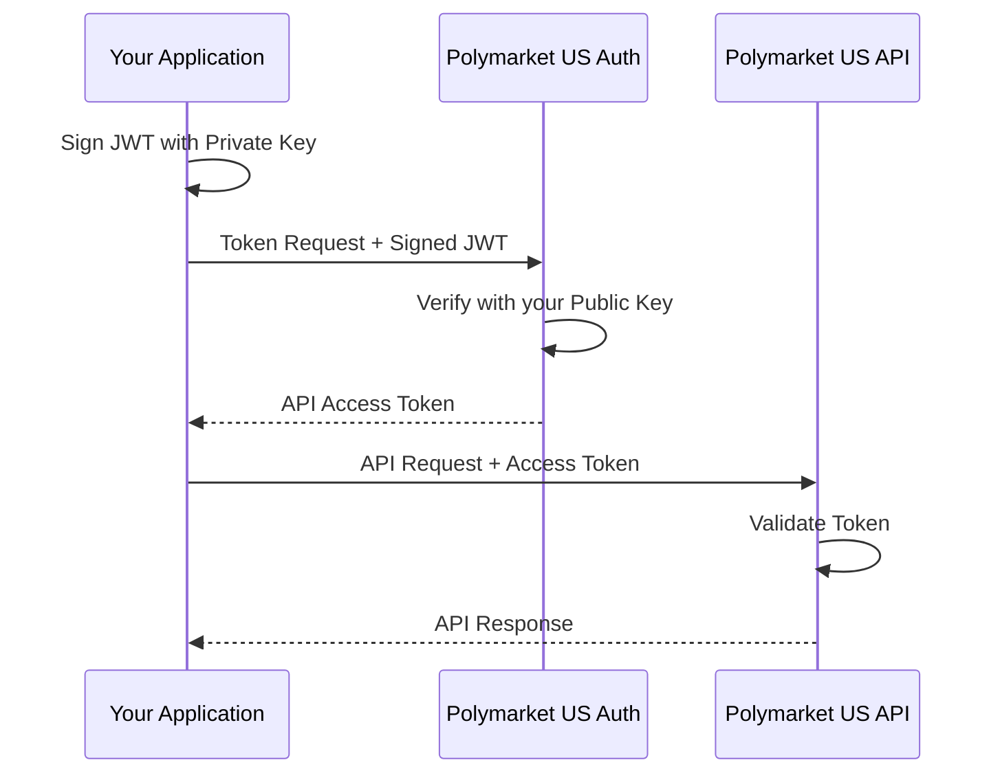

> ## Documentation Index
> Fetch the complete documentation index at: https://docs.polymarket.us/llms.txt
> Use this file to discover all available pages before exploring further.

# Authentication

> High-level overview of Private Key JWT authentication for partners, with the partner-specific details and a pointer to the full implementation guide.

The Polymarket US API uses **Private Key JWT** authentication with RSA keys — the **same mechanism used across the platform**, including by institutional traders. You sign a JWT with your RSA private key and exchange it for a short-lived access token.

<Card title="Full authentication guide" icon="key" href="/trader-guide/authentication">
  Key generation, JWT claims, code samples (Python, Go, curl), key rotation, troubleshooting, and the complete scope reference live in the **Institutional API → Getting Started** guide. This page covers what's specific to partners and links you there for the implementation details.
</Card>

<Note>
  Your RSA key pairs are generated during [Partner Onboarding](/partners/get-connected/onboarding) — you share only the **public** keys with Polymarket US and keep the private keys secure.
</Note>

## How it works



1. **Create a signed JWT assertion** — sign a JWT with your private key.
2. **Exchange it for an access token** — send the assertion to the token endpoint.
3. **Call the API with the access token** — include it as a `Bearer` token on each request.

The [full guide](/trader-guide/authentication) has the exact JWT claims, token request, and ready-to-use Python and Go clients.

## Environments

| Environment    | Auth Domain                | API Domain                           |
| -------------- | -------------------------- | ------------------------------------ |
| Pre-production | `pmx-preprod.us.auth0.com` | `api.preprod.polymarketexchange.com` |
| Production     | `pmx-prod.us.auth0.com`    | `api.prod.polymarketexchange.com`    |

<Note>
  Use `https://[API Domain]` for both the JWT audience claim and the API base URL. Each environment requires separate onboarding — pre-production credentials do not work in production.
</Note>

## Prerequisites

After completing [Partner Onboarding](/partners/get-connected/onboarding), you will have everything you need to authenticate:

| You have                   | From onboarding                                              |
| -------------------------- | ------------------------------------------------------------ |
| Private key file           | Generated by you (keep secure)                               |
| Client ID                  | Provided by Polymarket US in your shared Google Drive folder |
| Auth Domain & API Audience | See [Environments](#environments) above                      |

## Acting on behalf of a participant

This is the main partner-specific difference. You authenticate **once as your Firm**, then act on behalf of the Retail Participants you onboard by including the **`x-participant-id`** header on account-scoped requests (trading, positions, reports):

```bash theme={null}
curl -X GET "https://api.preprod.polymarketexchange.com/v1/whoami" \
  -H "Authorization: Bearer YOUR_ACCESS_TOKEN" \
  -H "x-participant-id: firms/ISV-Participant-YourISV/users/participant-123"
```

Use [`GET /v1/users`](/institutional/accounts/overview#endpoints) to discover the participant IDs your Firm may act on behalf of. See [Participants](/partners/onboarding/users) for how to resolve identities, and [Accounts & Identity](/trader-guide/accounts-identity) for the full hierarchy.

## Scopes

Your application is granted **scopes** that control which endpoints you can call. The scopes most relevant to partners include:

| Scope                            | Grants                                                   |
| -------------------------------- | -------------------------------------------------------- |
| `read:kyc` / `write:kyc`         | View KYC status; start verification and manage webhooks  |
| `read:accounts`                  | View identities (`/v1/whoami`, `/v1/users`) and accounts |
| `read:orders` / `write:orders`   | View and place/cancel/modify orders                      |
| `read:positions`                 | Positions, balances, and balance/position ledgers        |
| `read:funding` / `write:funding` | View funding; create transfers                           |

<Note>
  The **authoritative scope list and the full scope-by-endpoint mapping** are maintained in the [full authentication guide](/trader-guide/authentication#api-scopes). Missing a required scope returns `403 Forbidden` (REST) / `PERMISSION_DENIED` (gRPC).
</Note>

## Next steps

<CardGroup cols={2}>
  <Card title="Full authentication guide" icon="key" href="/trader-guide/authentication">
    JWT claims, code samples, key rotation, and troubleshooting.
  </Card>

  <Card title="Partner Onboarding" icon="id-card" href="/partners/get-connected/onboarding">
    Get your keys registered and receive your Client ID.
  </Card>

  <Card title="Quickstart" icon="rocket" href="/partners/get-connected/quickstart">
    Authenticate and place your first order end to end.
  </Card>

  <Card title="Troubleshooting" icon="wrench" href="/trader-guide/authentication-troubleshooting">
    Resolve common authentication errors.
  </Card>
</CardGroup>
