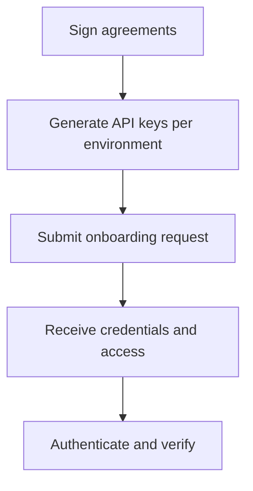

> ## Documentation Index
> Fetch the complete documentation index at: https://docs.polymarket.us/llms.txt
> Use this file to discover all available pages before exploring further.

# Partner Onboarding

> What partner onboarding involves: the inputs we need from you and the credentials and access you receive.

Onboarding is how your firm goes from "interested partner" to "able to call the API." It establishes your legal agreements and provisions your API credentials in each environment.

<Note>
  **Audience: business and technical leads.** Onboarding spans legal agreements and API credential setup, so expect both commercial and developer steps.
</Note>

<Card title="Start onboarding" icon="envelope" href="mailto:institutional@polymarket.us" horizontal>
  Email **[institutional@polymarket.us](mailto:institutional@polymarket.us)** to kick off the process and get your onboarding folder set up.
</Card>

## At a glance

## What you provide vs. what you receive

| You provide                                                                    | You receive                                          |
| ------------------------------------------------------------------------------ | ---------------------------------------------------- |
| Signed partner agreement (ISV or IB) and participant agreements for your users | A **Client ID** for each environment                 |
| RSA **public** keys (one per environment)                                      | Access to **pre-production** and **production**      |
| AWS Account ID (only if using FIX connectivity)                                | FIX connection details (if requested)                |
| Primary technical and business contacts                                        | A shared Google Drive folder for credential delivery |

## Step 1 — Sign the agreements

The agreements depend on your partner type:

<CardGroup cols={2}>
  <Card title="ISV agreement" icon="file-contract" href="/partners/partner-types/isvs">
    The ISV Connectivity Agreement and the participant clickthrough agreements you present to your users.
  </Card>

  <Card title="IB agreement" icon="scale-balanced" href="/partners/partner-types/ibs">
    The IB Participant Agreement, plus the CFTC/NFA regulatory requirements specific to Introducing Brokers.
  </Card>
</CardGroup>

Your Retail Participants must accept the appropriate participant agreement before they begin KYC. See [ISVs](/partners/partner-types/isvs) for the individual and entity participant agreement links.

## Step 2 — Generate your API keys

Authentication uses Private Key JWT with RSA keys. Generate a key pair **per environment** and share only the **public** keys with Polymarket US — never your private keys.

<Card title="Authentication — key generation" icon="key" href="/partners/get-connected/authentication">
  Step-by-step key generation and the full authentication flow.
</Card>

<Warning>
  Keep your private keys secure and never share them. You submit only the public keys during onboarding.
</Warning>

## Step 3 — Submit your onboarding request

1. Create a Google Drive folder containing your **public key file(s)** and your completed agreement(s).
2. Grant access to the folder as directed by your Polymarket US contact.
3. Email [institutional@polymarket.us](mailto:institutional@polymarket.us) with your firm name and a link to the folder.

<Info>
  **Using FIX connectivity?** Also include your **AWS Account ID** so a private connection can be established, and note FIX in your request. You still generate and submit RSA key pairs even if FIX is your primary connectivity method. See the [FIX API](/institutional/fix-api/fix-overview) for protocol details.
</Info>

## Step 4 — Receive your credentials

Polymarket US reviews your submission and provisions your access:

* A **Client ID** for each environment, delivered to your shared Google Drive folder.
* Access to **pre-production** (for integration and testing) and **production**.

<Note>
  Your **pre-production** environment is provisioned with test funds so you can exercise the full flow — authentication, KYC, and trading — before going live.
</Note>

## Next steps

<CardGroup cols={2}>
  <Card title="Authentication" icon="key" href="/partners/get-connected/authentication">
    Exchange your signed JWT for an access token and call the API.
  </Card>

  <Card title="Quickstart" icon="rocket" href="/partners/get-connected/quickstart">
    Place your first order end to end.
  </Card>
</CardGroup>
