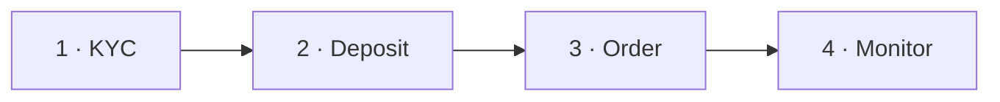

> ## Documentation Index
> Fetch the complete documentation index at: https://docs.polymarket.us/llms.txt
> Use this file to discover all available pages before exploring further.

# Quickstart

> Onboard a participant, fund their trading account, and place their first order with a declared vendor fee.

<Note>
  **Audience: developers.** This is a hands-on, copy-paste guide. For eligibility, agreements, and the business setup, see [ISVs](/partners/partner-types/isvs) / [IBs](/partners/partner-types/ibs) and [Partner Onboarding](/partners/get-connected/onboarding).
</Note>

This guide walks the core partner loop end to end — the same moves your production integration will repeat for every participant:



By the end you'll have:

1. Authenticated with the API as your Firm — your only credential; every action after this is **on behalf of a participant**
2. Onboarded a Retail Participant via KYC and captured their trading account
3. Funded their account with a **deposit transfer** from your partner funding account
4. Placed a FOK limit order with a **declared vendor fee** on their behalf
5. Seen where the money moves — and how fees are collected later

<Info>
  **Prerequisites:** Complete [Partner Onboarding](/partners/get-connected/onboarding) to receive your Client ID and register your public key, and have your **funding relationship** configured ([Partner Funding](/partners/funding/overview) is Beta, enabled per partner). This guide uses **pre-production** (`api.preprod.polymarketexchange.com`).
</Info>

## Step 1: Authenticate

Authentication uses **Private Key JWT** — you sign a JWT with your private key and exchange it for a short-lived access token. The full mechanism, claims, and key rotation are covered in the [Authentication](/partners/get-connected/authentication) guide; the complete, runnable token code is in the [full script](#complete-example) at the bottom of this page.

Once you have a token, set your auth header and confirm your identity with [`GET /v1/whoami`](/institutional/accounts/overview#endpoints):

```python theme={null}
import requests

BASE_URL = "https://api.preprod.polymarketexchange.com"
headers = {
    "Authorization": f"Bearer {access_token}",  # from the auth guide
    "Content-Type": "application/json",
}

resp = requests.get(f"{BASE_URL}/v1/whoami", headers=headers)
resp.raise_for_status()
print(f"Authenticated as: {resp.json()}")
```

Expected response:

```json theme={null}
{
  "user": "firms/ISV-Participant-Acme/users/admin",
  "userDisplayName": "Your Company",
  "firm": "ISV-Participant-Acme",
  "firmDisplayName": "Acme Trading",
  "firmType": "FIRM_TYPE_PARTICIPANT"
}
```

<Note>
  **Your Firm authenticates; it never trades or holds funds.** The Firm identity above is a permissions container — every trading action in this guide is performed **on behalf of a Retail Participant**. Participant-scoped REST calls (positions, reports) identify them with the `x-participant-id` header — see [Authentication → Acting on behalf of a participant](/partners/get-connected/authentication#acting-on-behalf-of-a-participant). Partner order entry and transfers carry the participant's provisioned DCM **trading account** in the request body. You'll capture both identifiers in Step 2.
</Note>

## Step 2: Onboard a participant (KYC)

Before you can fund an account or place an order for a Retail Participant, they must pass KYC. Submit their identity data with [`POST /v1/kyc/start`](/partners/onboarding/kyc/verification-flow):

```python theme={null}
kyc = {
    "external_id": "user-123",           # your internal ID for this participant
    "ssn": "123456789",
    "first_name": "Jane",
    "last_name": "Smith",
    "date_of_birth": "1990-06-15",
    "email": "jane.smith@example.com",
    "phone_number": "+12125551234",
    "address": {
        "address_line_1": "123 Main St",
        "city": "New York",
        "state": "NY",
        "postal_code": "10001",
        "country": "US",
    },
    "agreement": {"version": "PMX.ISV.v1.0", "signed_at": "2026-04-24T14:30:00Z"},
    "ip_address": "203.0.113.42",        # the participant's IP
}

resp = requests.post(f"{BASE_URL}/v1/kyc/start", headers=headers, json=kyc)
resp.raise_for_status()
print(resp.json()["status"])  # decision path — see the decision matrix
```

The outcome may be instant approval, document verification, or manual review — handle each per the [decision matrix](/partners/onboarding/kyc/verification-flow#decision-matrix). **Approval is asynchronous**: the terminal outcome arrives on your registered [webhook](/partners/onboarding/kyc/webhooks) as a `kyc.approved` event, which carries the two identifiers you need:

* **`provisioned_participant`** (e.g. `firms/ISV-Participant-Acme/users/user-123`) — the `x-participant-id` value for participant-scoped REST calls.
* The participant's provisioned **DCM trading account** — use it as `order.account` for `CreateVendorOrder`, `participant_account_id` for transfers, and the account identity on Drop Copy and reconciliation records.

You can also list accounts under your Firm at any time:

```python theme={null}
resp = requests.get(f"{BASE_URL}/v1/accounts", headers=headers)
resp.raise_for_status()
print(resp.json()["accounts"])
# ["firms/ISV-Participant-Acme/accounts/user-123-trading", ...]

participant_account = resp.json()["accounts"][0]
```

<Info>
  The account is provisioned with a **\$0 balance**. The participant can trade as soon as you fund it — the next step.
</Info>

## Step 3: Fund the account (deposit transfer)

When the participant allocates wallet funds to trading, mirror the allocation onto the platform with a [`DEPOSIT` transfer](/partners/funding/deposits-withdrawals) — partner funding account → participant account. The transfer API is **gRPC-only** ([`CashMovementService`](/partners/funding/transfers)):

```python theme={null}
import uuid
import grpc
from polymarket.us.cashmovement.v1 import cash_movement_pb2, cash_movement_pb2_grpc

channel = grpc.secure_channel("<grpc-endpoint>:443", grpc.ssl_channel_credentials())
cash_stub = cash_movement_pb2_grpc.CashMovementServiceStub(channel)
metadata = [("authorization", f"Bearer {access_token}")]

idempotency_key = str(uuid.uuid4())  # persist BEFORE sending, so you can retry safely
request = cash_movement_pb2.CreateCashMovementRequest(
    idempotency_key=idempotency_key,
    transfer=cash_movement_pb2.Transfer(
        reason=cash_movement_pb2.TRANSFER_REASON_DEPOSIT,
        participant_account_id=participant_account,
        amount="500.00",
        currency="USD",
        external_reference="wallet-alloc-8842",  # your journal reference
    ),
)

deposit = cash_stub.CreateCashMovement(request, metadata=metadata)
print(deposit.cash_movement.workflow_id, deposit.cash_movement.status)
```

Persist the request fields alongside `workflow_id`; the transfer read model does not echo `participant_account_id`, `external_reference`, or `memo`. Wait until the workflow is `CONFIRMED` before placing the order. If it remains `PENDING`, recover the same workflow rather than creating another; if it is `AMBIGUOUS`, replay the identical request with the same idempotency key. Once confirmed, the participant has \$500 of buying power — seconds after they allocated it in their wallet. See [Transfers](/partners/funding/transfers) for recovery, terminal statuses, and rate-limit handling.

## Step 4: Pick a market and instrument

Discover a market with the [Market API](/api-reference/market/overview), then confirm the one you want:

```python theme={null}
market_slug = "example-market-slug"

resp = requests.get(f"{BASE_URL}/v1/market/slug/{market_slug}", headers=headers)
resp.raise_for_status()
market = resp.json()
print(market["slug"], market["orderPriceMinTickSize"], market["minimumTradeQty"])
```

Partner order entry uses the exchange `symbol`, not the market slug. Use the [Reference Data API](/institutional/refdata/overview) to obtain the selected instrument's symbol, `priceScale`, `fractionalQtyScale`, tick size, and minimum quantity. Validate the participant's price and quantity against that metadata before submitting.

The embedded public order uses fixed-point integers. The `priceScale` and `fractionalQtyScale` values published by Reference Data are the multipliers:

```text theme={null}
wire price = decimal price × priceScale
wire share quantity = decimal shares × fractionalQtyScale
wire cash quantity = decimal USD × priceScale
```

The examples below assume both scales are `100`, making \$0.45 equal to `45`, 100 shares equal to `10000`, and “spend \$20” equal to `2000`.

## Step 5: Estimate cost and gate buying power

Placement returns no economics. The exchange is authoritative and checks that account cash covers worst-case collateral plus the applicable exchange fee. Your system must additionally subtract accrued, uncollected vendor fees:

```text theme={null}
spendable balance = account cash − accrued uncollected vendor fees
```

For a buy share limit order, estimate collateral as quantity × limit price; for a cash order, `cash_order_qty` is the requested maximum spend. Add the maximum exchange fee from the [fee schedule](/fees). If you need an informational server-side preview, call the optional public `polymarket.v1.OrderEntryAPI/PreviewOrder` with the same public order shape. It is not a locked quote; the exchange validates again at placement.

## Step 6: Place the order

`CreateVendorOrder` is the static-model order RPC partners should use. It embeds the public `polymarket.v1.InsertOrderRequest`, adds your declared vendor fee and idempotency key, and returns a durable order outcome. There is no separate customer-account field: the customer is identified solely by `order.account`.

```python theme={null}
from polymarket.v1 import trading_pb2
from polymarket.us.orderfunding.v1 import order_funding_pb2, order_funding_pb2_grpc

order_stub = order_funding_pb2_grpc.OrderFundingServiceStub(channel)

# Persist both identifiers before the first call.
clord_id = f"order-{uuid.uuid4()}"
idempotency_key = str(uuid.uuid4())

request = order_funding_pb2.CreateVendorOrderRequest(
    order=trading_pb2.InsertOrderRequest(
        type=trading_pb2.ORDER_TYPE_LIMIT,
        side=trading_pb2.SIDE_BUY,
        order_qty=10_000,  # 100.00 shares at fractionalQtyScale=100
        symbol="<market-symbol>",
        price=45,  # $0.45 at priceScale=100
        time_in_force=trading_pb2.TIME_IN_FORCE_FILL_OR_KILL,
        clord_id=clord_id,
        account=participant_account,
        manual_order_indicator=trading_pb2.MANUAL_ORDER_INDICATOR_MANUAL,
    ),
    vendor_fee=order_funding_pb2.MoneyAmount(value="0.10", currency="USD"),
    idempotency_key=idempotency_key,
)

result = order_stub.CreateVendorOrder(request, metadata=metadata)
print(result.status, result.id, result.funding_request_id)
```

The partner launch allowlist is intentionally narrow. Set only the fields shown for this use case; `order.user`, `order.session_id`, non-FOK time-in-force values, non-default `good_till_time`, and every unsupported feature are rejected with `INVALID_ARGUMENT` naming the offending field. See the [supported-fields table](/partners/orders/data-model) and the [cash-order example](/partners/orders/create-order#consumer-cash-order-spend-20).

Handle all three durable outcomes:

| Status                         | Meaning                                                                                                                                                                             | What you do                                                                                    |
| ------------------------------ | ----------------------------------------------------------------------------------------------------------------------------------------------------------------------------------- | ---------------------------------------------------------------------------------------------- |
| `VENDOR_ORDER_STATUS_ACCEPTED` | The exchange durably accepted the order — including an order that matched immediately or was cancelled under fill-or-kill. Acceptance does not mean the order is resting or filled. | Learn execution outcomes from Drop Copy and add the declared fee to your accrual.              |
| `VENDOR_ORDER_STATUS_REJECTED` | The order was rejected. Nothing was recorded and no fee accrues.                                                                                                                    | Surface the rejection; nothing to clean up.                                                    |
| `VENDOR_ORDER_STATUS_PENDING`  | The durable exchange outcome was not confirmed within the deadline.                                                                                                                 | Retry the identical request with the **same** `idempotency_key` and `clord_id` until terminal. |

The service guarantees **at most one order per idempotency key — retrying with the same key can never place a duplicate order or double-charge the declared vendor fee.** On transport errors (`UNAVAILABLE`, timeouts), also retry the identical request with the same key and `clord_id`. Match the participant's Drop Copy activity by `order.account` and `clord_id`. See [idempotency and retries](/partners/orders/create-order#idempotency-and-retries) and the [funding request lifecycle](/partners/orders/create-order#funding-request-lifecycle).

## Step 7: Watch the money

Every cash event is visible in real time — this is how your backend keeps its books and its buying-power gate current:

* The **deposit transfer** appears on the [Balance Ledger Stream](/streaming-endpoints/balance-ledger-stream) for the participant account and your funding account.
* **Fills** arrive on the [Drop Copy Stream](/streaming-endpoints/dropcopy-stream); per-execution exchange fees and settlement credits land on the ledger.
* **Trading proceeds stay in the account** — settlement credits and realized profit simply increase the participant's buying power. Nothing needs to move after fills or settlements.
* Persist the response's `correlation` identifiers with `order.account`, `clord_id`, and the exchange order ID. They tie ledger entries and vendor-fee reporting back to the placement workflow.

<Note>
  **Scaling note — per-account balance streams are provided now for accelerated development.** The balance ledger subscription is **per-account**, and concurrent ledger streams per firm are capped — opening one stream per participant does not scale to thousands of accounts. A **firm-level balance stream** delivering ledger entries for every account under your Firm on a single subscription is coming soon. Build against the per-account stream today, but plan for the firm-level stream in production — see [firm-wide ledger consumption](/partners/reconciliation#firm-wide-ledger-consumption) for the interim pattern. Drop Copy is the opposite: **one** long-lived firm stream, not one per order — [Streaming Best Practices](/streaming-endpoints/streaming-best-practices).
</Note>

## Step 8: Fees and withdrawals — later, not per order

Two flows complete the lifecycle, and neither happens at order time:

* **Vendor fees**: the fee you declared in Step 6 accrued as a receivable. Collect accrued fees periodically — **at most once per day per participant account** — with one [`VENDOR_FEES` transfer](/partners/funding/transfers) per participant account, reconciled against the daily [Vendor Fees report](/partners/funding/vendor-fees).
* **Withdrawals**: when the participant de-allocates funds in their wallet, mirror it with a [`WITHDRAWAL` transfer](/partners/funding/deposits-withdrawals#withdrawals) — checking their free cash (net of accrued fees) first.

## Complete example

A single runnable script covering the deposit-and-order path — including the full token exchange (see the [Authentication](/partners/get-connected/authentication) guide for an explanation of each claim). KYC is omitted because its terminal outcome arrives on your webhook; run Step 2 once and plug in the resulting account and the instrument metadata from Step 4:

```python theme={null}
#!/usr/bin/env python3
"""Polymarket US partner quickstart — deposit and place a FOK order."""

import jwt
import uuid
import time
import grpc
import requests
from cryptography.hazmat.primitives import serialization

from polymarket.v1 import trading_pb2
from polymarket.us.cashmovement.v1 import cash_movement_pb2, cash_movement_pb2_grpc
from polymarket.us.orderfunding.v1 import order_funding_pb2, order_funding_pb2_grpc

# Configuration (from Partner Onboarding)
AUTH_DOMAIN = "pmx-preprod.us.auth0.com"
CLIENT_ID = "your_client_id"
AUDIENCE = "https://api.preprod.polymarketexchange.com"
PRIVATE_KEY_PATH = "private_key.pem"
BASE_URL = "https://api.preprod.polymarketexchange.com"
GRPC_ENDPOINT = "<grpc-endpoint>:443"

# From Step 2 (kyc.approved webhook / GET /v1/accounts) and Step 4
PARTICIPANT_ACCOUNT = "firms/ISV-Participant-Acme/accounts/user-123-trading"
MARKET_SLUG = "example-market-slug"
MARKET_SYMBOL = "<market-symbol>"


def get_access_token():
    with open(PRIVATE_KEY_PATH, "rb") as f:
        private_key = serialization.load_pem_private_key(f.read(), password=None)

    now = int(time.time())
    claims = {
        "iss": CLIENT_ID,
        "sub": CLIENT_ID,
        "aud": f"https://{AUTH_DOMAIN}/oauth/token",
        "iat": now,
        "exp": now + 300,
        "jti": str(uuid.uuid4()),
    }
    assertion = jwt.encode(claims, private_key, algorithm="RS256")

    response = requests.post(
        f"https://{AUTH_DOMAIN}/oauth/token",
        json={
            "client_id": CLIENT_ID,
            "client_assertion_type": "urn:ietf:params:oauth:client-assertion-type:jwt-bearer",
            "client_assertion": assertion,
            "audience": AUDIENCE,
            "grant_type": "client_credentials",
        },
    )
    response.raise_for_status()
    return response.json()["access_token"]


def main():
    token = get_access_token()
    headers = {"Authorization": f"Bearer {token}", "Content-Type": "application/json"}

    # Verify the Firm identity.
    resp = requests.get(f"{BASE_URL}/v1/whoami", headers=headers)
    resp.raise_for_status()
    print(f"Logged in as: {resp.json()}")

    # Confirm the market; resolve symbol and scales through Reference Data in production.
    resp = requests.get(f"{BASE_URL}/v1/market/slug/{MARKET_SLUG}", headers=headers)
    resp.raise_for_status()
    print(f"Trading market: {resp.json()['slug']}")

    # gRPC channel shared by the transfer and order APIs.
    channel = grpc.secure_channel(GRPC_ENDPOINT, grpc.ssl_channel_credentials())
    metadata = [("authorization", f"Bearer {token}")]

    # Fund the account — persist this logical transfer and key before sending.
    cash_stub = cash_movement_pb2_grpc.CashMovementServiceStub(channel)
    deposit_key = str(uuid.uuid4())
    deposit_request = cash_movement_pb2.CreateCashMovementRequest(
        idempotency_key=deposit_key,
        transfer=cash_movement_pb2.Transfer(
            reason=cash_movement_pb2.TRANSFER_REASON_DEPOSIT,
            participant_account_id=PARTICIPANT_ACCOUNT,
            amount="500.00",
            currency="USD",
            external_reference="wallet-alloc-8842",
        ),
    )
    deposit = cash_stub.CreateCashMovement(deposit_request, metadata=metadata)
    print(f"Deposit: {deposit.cash_movement.workflow_id} "
          f"{cash_movement_pb2.CashMovementStatus.Name(deposit.cash_movement.status)}")

    if deposit.cash_movement.status != cash_movement_pb2.CASH_MOVEMENT_STATUS_CONFIRMED:
        raise RuntimeError("Wait for the deposit workflow to reach CONFIRMED before ordering")

    # Place a 100-share, $0.45 FOK limit order. Values assume both scales are 100.
    order_stub = order_funding_pb2_grpc.OrderFundingServiceStub(channel)
    clord_id = f"order-{uuid.uuid4()}"
    order_key = str(uuid.uuid4())
    order_request = order_funding_pb2.CreateVendorOrderRequest(
        order=trading_pb2.InsertOrderRequest(
            type=trading_pb2.ORDER_TYPE_LIMIT,
            side=trading_pb2.SIDE_BUY,
            order_qty=10_000,
            symbol=MARKET_SYMBOL,
            price=45,
            time_in_force=trading_pb2.TIME_IN_FORCE_FILL_OR_KILL,
            clord_id=clord_id,
            account=PARTICIPANT_ACCOUNT,
            manual_order_indicator=trading_pb2.MANUAL_ORDER_INDICATOR_MANUAL,
        ),
        vendor_fee=order_funding_pb2.MoneyAmount(value="0.10", currency="USD"),
        idempotency_key=order_key,
    )
    result = order_stub.CreateVendorOrder(order_request, metadata=metadata)
    print(f"Status: {order_funding_pb2.VendorOrderStatus.Name(result.status)}")
    print(f"Order ID: {result.id}  funding_request_id: {result.funding_request_id}")


if __name__ == "__main__":
    main()
```

**Required packages:**

```bash theme={null}
pip install PyJWT cryptography requests grpcio
```

The `polymarket.v1`, `polymarket.us.cashmovement.v1`, and `polymarket.us.orderfunding.v1` stubs are generated from API protos provided during beta enablement — contact [institutional@polymarket.us](mailto:institutional@polymarket.us) if you don't have them.

## Next steps

<CardGroup cols={2}>
  <Card title="Create Order" icon="bolt" href="/partners/orders/create-order">
    Request and response contract, supported examples, and retry behavior.
  </Card>

  <Card title="Order Data Model" icon="table" href="/partners/orders/data-model">
    Fixed-point values and the fail-closed launch allowlist.
  </Card>

  <Card title="Transfers" icon="right-left" href="/partners/funding/transfers">
    Deposits, withdrawals, vendor fee collection, and paced queues.
  </Card>

  <Card title="Partner Funding" icon="building-columns" href="/partners/funding/overview">
    The full model — parties, money flows, and the transfer budget.
  </Card>

  <Card title="KYC Verification" icon="id-card" href="/partners/onboarding/kyc/overview">
    All verification outcomes and webhook handling.
  </Card>

  <Card title="Balance Ledger Stream" icon="scale-balanced" href="/streaming-endpoints/balance-ledger-stream">
    Track every deposit, fill, and settlement credit in real time.
  </Card>
</CardGroup>
