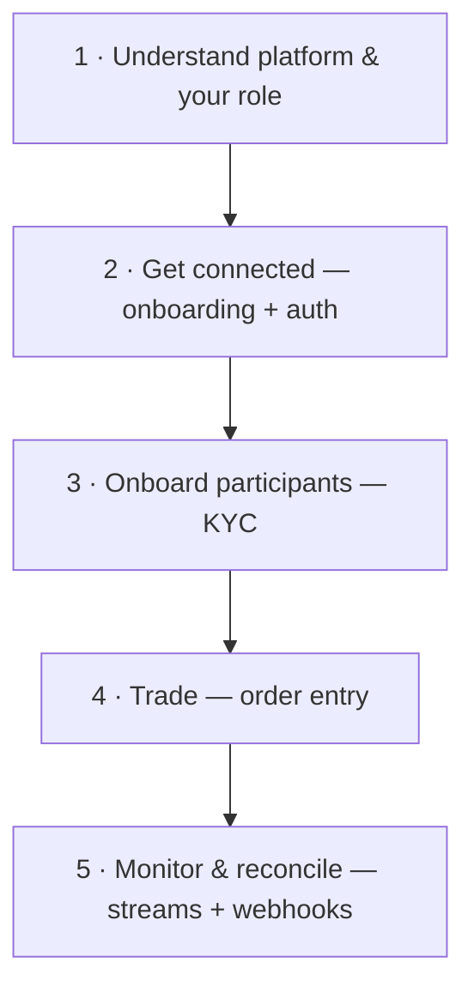

> ## Documentation Index
> Fetch the complete documentation index at: https://docs.polymarket.us/llms.txt
> Use this file to discover all available pages before exploring further.

# Integration Journey

> The end-to-end path from partner onboarding to live trading — and the recommended order to build it.

This page is your map. It lays out the partner integration end to end so you can see how the pieces fit before you start building, then points you to the right guide for each step.

## The journey at a glance

<Note>
  **Funding is in beta.** Your funding entity **pre-positions pooled funds** at Polymarket US and funds each participant's trading account with instant deposit transfers that mirror their wallet allocation, via [Partner Funding](/partners/funding/overview), enabled per partner. There is no per-participant bank-deposit step in the journey.
</Note>

## What you'll build

A complete partner integration has a handful of components. You can build them incrementally in the order below.

| Component            | Purpose                                                           | Primary interface                                           |
| -------------------- | ----------------------------------------------------------------- | ----------------------------------------------------------- |
| **Auth client**      | Authenticate as your Firm and refresh access tokens               | [Private Key JWT](/partners/get-connected/authentication)   |
| **KYC flow**         | Onboard and verify Retail Participants                            | [KYC](/partners/onboarding/kyc/overview)                    |
| **Order entry**      | Submit orders with declared vendor fees on behalf of participants | [Submitting Orders](/partners/orders/create-order) *(Beta)* |
| **Funding**          | Fund participant trading accounts and collect vendor fees         | [Partner Funding](/partners/funding/overview) *(Beta)*      |
| **Stream consumers** | Maintain a live mirror of orders, positions, and balances         | [gRPC streaming](/streaming-endpoints/grpc-overview)        |
| **Webhook receiver** | Receive KYC and account lifecycle notifications                   | Account notifications *(coming soon)*                       |

<Info>
  Polymarket US is a **streaming-first** platform. REST endpoints are intended for one-off queries and are rate-limited; continuous data should come from streams. Keep this in mind as you design every component above.
</Info>

## Recommended reading order

<Steps>
  <Step title="Understand the platform and your role">
    Start with [Your Role](/partners/your-role) and the [Platform Model](/partners/platform-model). Keep the [Glossary](/partners/glossary) open in a tab.
  </Step>

  <Step title="Understand funding">
    Your funding entity **pre-positions pooled funds** and funds participant accounts with instant deposit transfers, with vendor fees declared per order and collected periodically — read the [Partner Funding](/partners/funding/overview) *(Beta)* model before designing your deposit, order, and fee flows. Contact your Polymarket US integration lead to enable funding for your integration.
  </Step>

  <Step title="Get connected">
    Complete partner [onboarding](/partners/get-connected/onboarding), then set up [authentication](/partners/get-connected/authentication). Confirm you can call `GET /v1/whoami` successfully.
  </Step>

  <Step title="Onboard your participants">
    Implement the [KYC flow](/partners/onboarding/kyc/overview). You **collect** each participant's required information and submit it; Polymarket US **performs the verification and decision**. On approval, the Retail Participant and their [account](/partners/onboarding/accounts) are provisioned automatically. See [Onboard Participants](/partners/onboarding/users).
  </Step>

  <Step title="Place your first order">
    Walk through the [Quickstart](/partners/get-connected/quickstart) to authenticate, list instruments, and place and cancel an order end to end.
  </Step>

  <Step title="Monitor and reconcile">
    Subscribe to the [order, position, and balance streams](/streaming-endpoints/grpc-overview) and maintain a local mirror. Add a webhook receiver for KYC and account lifecycle events.
  </Step>
</Steps>

## Start here

<CardGroup cols={2}>
  <Card title="Your Role" icon="user-gear" href="/partners/your-role">
    What you do, what we do, and what you never handle.
  </Card>

  <Card title="Platform Model" icon="sitemap" href="/partners/platform-model">
    DCM + DCO and the entities you act on.
  </Card>

  <Card title="Authentication" icon="key" href="/partners/get-connected/authentication">
    Authenticate as your Firm with Private Key JWT.
  </Card>

  <Card title="Quickstart" icon="rocket" href="/partners/get-connected/quickstart">
    Place your first order end to end.
  </Card>
</CardGroup>
