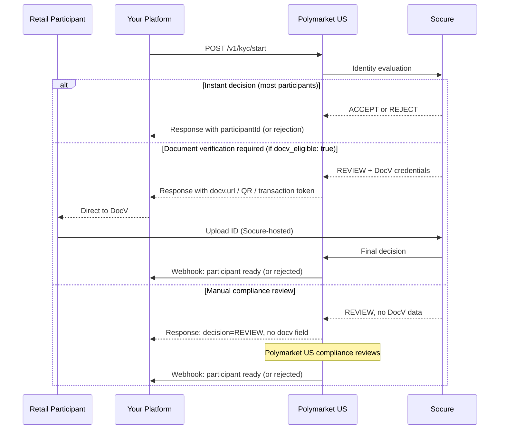

> ## Documentation Index
> Fetch the complete documentation index at: https://docs.polymarket.us/llms.txt
> Use this file to discover all available pages before exploring further.

# Overview

> How identity verification works for partners: the Socure-backed KYC process, its four outcomes, and the integration architecture.

<Warning>
  **BETA — SUBJECT TO CHANGE.** This API is in beta and may change without notice.
</Warning>

Before any Retail Participant can trade, they must pass a **KYC (Know Your Customer)** identity check. Polymarket US uses [Socure](https://www.socure.com/) as its identity verification (IDV) provider. You collect the participant's information and submit it; Socure performs the identity evaluation; and on approval Polymarket US provisions the participant's trading account. You receive the result via a webhook you register in advance.

<Info>
  **You don't talk to Socure for evaluation — Polymarket US does.** You call the KYC endpoints on your participant's behalf, and Polymarket US handles the Socure evaluation and account provisioning. The only time a participant's device touches Socure directly is the optional [Digital Intelligence](/partners/onboarding/kyc/digital-intelligence) script and, when required, the document-upload (DocV) UI.
</Info>

## What a participant experiences

1. They complete an identity form on your platform (name, address, SSN, date of birth) and accept the participant agreement. Optionally, the [Prefill Flow](/partners/onboarding/kyc/prefill-flow) can auto-populate most of the form from their phone number and date of birth via an SMS one-time passcode.
2. In most cases, verification is **instant** — approved or rejected within seconds.
3. Sometimes Socure asks them to **upload a photo ID** (document verification, "DocV") via a web URL or a mobile SDK. *This happens only if you [opted the evaluation in](/partners/onboarding/kyc/verification-flow#document-verification-docv) with `docv_eligible: true`; otherwise these cases go to manual review.*
4. In a small number of cases, the application needs **manual review** by the Polymarket US compliance team — no action required from the participant.
5. Once approved, their trading account is ready and you receive a webhook.

## The four outcomes

Every `POST /v1/kyc/start` resolves to one of four outcomes:

| Outcome                          | What it means                          | Your next step                                                                                                                                                                                                            |
| -------------------------------- | -------------------------------------- | ------------------------------------------------------------------------------------------------------------------------------------------------------------------------------------------------------------------------- |
| **Instant approval**             | The identity was verified immediately  | Await the [`kyc.approved` webhook](/partners/onboarding/kyc/webhooks) for the provisioned `participantId` (provisioning is async — see below)                                                                             |
| **Document verification (DocV)** | The provider needs a photo ID          | Direct the participant to `docv.url` or the Socure SDK. Requires opting in with [`docv_eligible: true`](/partners/onboarding/kyc/verification-flow#document-verification-docv); otherwise these cases go to manual review |
| **Manual compliance review**     | Automated checks were inconclusive     | Tell the participant to wait; await the webhook                                                                                                                                                                           |
| **Rejection**                    | Verification or risk assessment failed | Notify the participant — they cannot trade                                                                                                                                                                                |

See [Verification Flow](/partners/onboarding/kyc/verification-flow) for the request/response of each outcome and the decision matrix.

<Warning>
  **Approval is asynchronous even when instant.** A successful `POST /v1/kyc/start` may return a **non-terminal status with no `participantId` yet** while provisioning completes in the background. The final `participantId` arrives via the [webhook](/partners/onboarding/kyc/webhooks) and a later [`GET /v1/kyc/status`](/partners/onboarding/kyc/verification-flow#check-status). Don't assume it's on the initial response.
</Warning>

## Integration architecture

Polymarket US sits between your platform and Socure. You never call Socure directly for evaluation; for document verification, the participant's browser or app connects to Socure's hosted UI.

## REST and gRPC

Every KYC action is available over **both REST and gRPC**. They are the same underlying service — identical fields, semantics, outcomes, and scopes — so choose whichever transport fits your stack and mix freely:

| Action                                | REST                       | gRPC (`polymarket.us.kyc.v1.KYCAPI`) |
| ------------------------------------- | -------------------------- | ------------------------------------ |
| Submit a participant for verification | `POST /v1/kyc/start`       | `StartKYCVerification`               |
| Check current status                  | `GET /v1/kyc/status`       | `GetKYCStatus`                       |
| Register your webhook URL             | `POST /v1/kyc/webhook`     | `SetWebhookURL`                      |
| Start identity prefill *(optional)*   | `POST /v1/kyc/prefill`     | `StartKYCPrefill`                    |
| Submit prefill OTP *(optional)*       | `POST /v1/kyc/prefill/otp` | `SubmitKYCPrefillOTP`                |

Both transports authenticate with the same firm [access token](/partners/get-connected/authentication) — REST in the `Authorization` header, gRPC as `authorization: Bearer <token>` metadata on each RPC. These pages use REST for the worked examples; the gRPC message shapes are in [Verification Flow → Using gRPC](/partners/onboarding/kyc/verification-flow#using-grpc).

## Field naming

The REST API is a JSON mapping of the same protobuf-defined service, which is why casing differs by direction — map fields by meaning rather than assuming one style across the whole flow:

* **Request bodies and query parameters** use `snake_case` (e.g. `external_id`, `date_of_birth`).
* **REST JSON responses** use `camelCase` (e.g. `externalId`, `participantId`, `subStatus`) — they follow protobuf JSON naming.
* **gRPC messages** use the proto field names (`snake_case`) natively.
* **Webhook payloads** use `snake_case` (e.g. `external_id`, `provisioned_participant`).

We may align casing across the API in a future version; any change will be announced in the [changelog](/changelog).

## Prerequisites

Before going live, make sure you have:

| Item                                                                        | Provided by                             |
| --------------------------------------------------------------------------- | --------------------------------------- |
| API credentials (Client ID + private key)                                   | Polymarket US onboarding team           |
| Socure **SDK key** — one key initialises both Digital Intelligence and DocV | Polymarket US onboarding team           |
| Participant agreement version string                                        | Polymarket US onboarding team           |
| An HTTPS **webhook URL**, registered via `POST /v1/kyc/webhook`             | You                                     |
| Socure mobile SDK *(only if you have a native app)*                         | [Socure](https://github.com/socure-inc) |

## Next steps

<CardGroup cols={2}>
  <Card title="Digital Intelligence" icon="shield-halved" href="/partners/onboarding/kyc/digital-intelligence">
    Capture the `session_token` that keeps your approval rate high.
  </Card>

  <Card title="Verification Flow" icon="id-card" href="/partners/onboarding/kyc/verification-flow">
    Submit a participant and handle each of the four outcomes.
  </Card>

  <Card title="Webhooks" icon="bell" href="/partners/onboarding/kyc/webhooks">
    Receive the async decision instead of polling.
  </Card>
</CardGroup>
