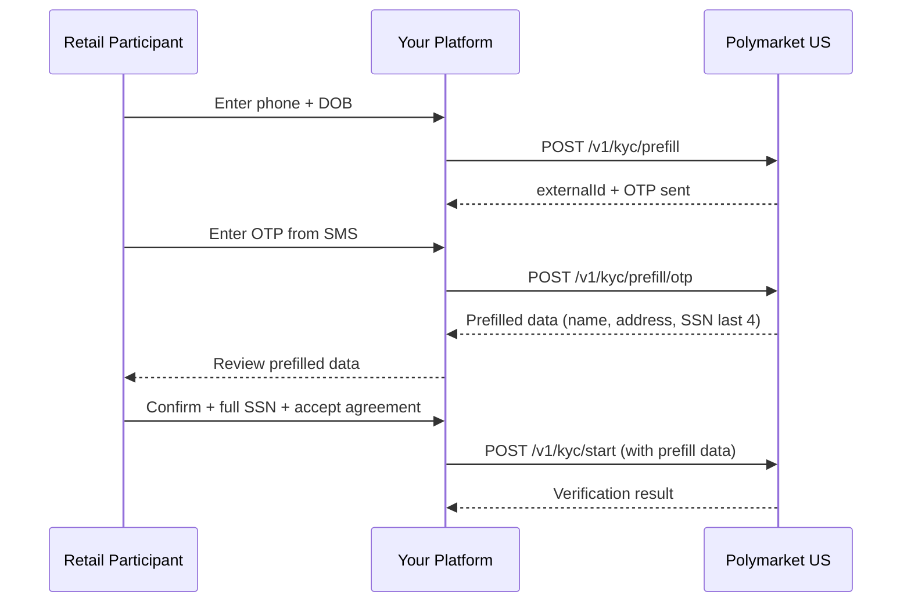

> ## Documentation Index
> Fetch the complete documentation index at: https://docs.polymarket.us/llms.txt
> Use this file to discover all available pages before exploring further.

# Prefill Flow

> Optionally pre-populate the KYC form from a phone number and date of birth to reduce data entry.

<Warning>
  **BETA — SUBJECT TO CHANGE.** This API is in beta and may change without notice.
</Warning>

Prefill lets a participant auto-populate their KYC information from their phone number, reducing manual data entry and form abandonment. It is **optional** and sits entirely *in front of* the standard flow — you can skip it, collect all fields yourself, and go straight to [`POST /v1/kyc/start`](/partners/onboarding/kyc/verification-flow). Nothing about verification, outcomes, or webhooks changes.

## How it works

1. The participant provides their phone number and date of birth.
2. Polymarket US sends a one-time passcode (OTP) to the phone.
3. The participant enters the OTP to verify ownership.
4. You receive prefilled identity data (name, address, last 4 of SSN, etc.).
5. The participant reviews and corrects it, provides the full SSN, accepts the agreement, and you submit the standard [verification request](/partners/onboarding/kyc/verification-flow).

## Step 1: Start prefill

```bash theme={null}
POST /v1/kyc/prefill
```

```json theme={null}
{
  "phone_number": "+15551234567",
  "date_of_birth": "1990-01-15",
  "user_id": "your-internal-user-id-123",
  "session_token": "{socure_di_session_token}",
  "ip_address": "203.0.113.42"
}
```

| Field           | Type   | Required | Description                                                                                               |
| --------------- | ------ | -------- | --------------------------------------------------------------------------------------------------------- |
| `phone_number`  | string | Yes      | E.164 format (e.g. `+15551234567`)                                                                        |
| `date_of_birth` | string | Yes      | `YYYY-MM-DD`                                                                                              |
| `user_id`       | string | Yes      | Your stable internal identifier for this participant                                                      |
| `session_token` | string | No       | Socure [Digital Intelligence](/partners/onboarding/kyc/digital-intelligence) token — strongly recommended |
| `ip_address`    | string | No       | Participant's IP address                                                                                  |

Response:

```json theme={null}
{
  "status": {
    "decision": "pending",
    "status": "otp_sent",
    "subStatus": "",
    "externalId": "your-internal-user-id-123"
  },
  "externalId": "your-internal-user-id-123"
}
```

Persist the returned `externalId` — it is the correlation identifier for the OTP step and for the subsequent verification request.

## Step 2: Submit OTP

```bash theme={null}
POST /v1/kyc/prefill/otp
```

```json theme={null}
{
  "otp": "123456",
  "external_id": "your-internal-user-id-123"
}
```

| Field         | Type   | Required | Description                                |
| ------------- | ------ | -------- | ------------------------------------------ |
| `otp`         | string | Yes      | The 6-digit code the participant received  |
| `external_id` | string | Yes      | The `externalId` from the prefill response |

On success, the response includes the prefilled identity data:

```json theme={null}
{
  "status": {
    "decision": "pending",
    "status": "prefill_complete",
    "subStatus": "",
    "externalId": "your-internal-user-id-123"
  },
  "firstName": "John",
  "middleName": "Michael",
  "lastName": "Doe",
  "dateOfBirth": "1990-01-15",
  "phoneNumber": "+15551234567",
  "email": "john.doe@example.com",
  "ssn": "1234",
  "address": {
    "addressLine1": "123 Main Street",
    "addressLine2": "Apt 4B",
    "city": "New York",
    "state": "NY",
    "postalCode": "10001",
    "country": "US"
  }
}
```

| Field                                   | Description            |
| --------------------------------------- | ---------------------- |
| `firstName` / `middleName` / `lastName` | Legal name             |
| `dateOfBirth`                           | Date of birth          |
| `phoneNumber`                           | Verified phone number  |
| `email`                                 | Email (if available)   |
| `ssn`                                   | **Last 4 digits only** |
| `address`                               | Residential address    |

<Note>
  All identity fields are optional and may be absent if the prefill provider has no data for this phone/DOB. Always let the participant review and edit prefilled values before submission.
</Note>

## Step 3: Submit to verification

Map the prefilled data into the standard [`POST /v1/kyc/start`](/partners/onboarding/kyc/verification-flow) request, collect the **full SSN** and agreement acceptance, and submit. Pass the prefill `externalId` as the request's `external_id` so the inquiry correlates end to end.

<Warning>
  Prefill returns only the **last 4 digits** of the SSN. Collect the full SSN from the participant before calling `/v1/kyc/start`.
</Warning>

From here the flow is exactly the [standard verification flow](/partners/onboarding/kyc/verification-flow) — same outcomes, decision matrix, and webhooks.

## Complete flow



## Using gRPC

Both steps are also available on `polymarket.us.kyc.v1.KYCAPI` with identical fields and semantics — see the [transport mapping](/partners/onboarding/kyc/overview#rest-and-grpc):

```protobuf theme={null}
// POST /v1/kyc/prefill ≡ KYCAPI/StartKYCPrefill
message StartKYCPrefillRequest {
  string date_of_birth; // YYYY-MM-DD
  string phone_number;
  string session_token;
  string user_id;       // your stable customer id
  string ip_address;
}
message StartKYCPrefillResponse {
  KYCStatus status;
  string external_id;
}

// POST /v1/kyc/prefill/otp ≡ KYCAPI/SubmitKYCPrefillOTP
message SubmitKYCPrefillOTPRequest { string otp; string external_id; }
message SubmitKYCPrefillOTPResponse {
  KYCStatus status;
  KYCAddress address;
  optional string ssn;  // last 4 digits
  optional string date_of_birth;
  optional string phone_number;
  optional string email;
  optional string first_name;
  optional string middle_name;
  optional string last_name;
}
```

## Error handling

| Error                 | Cause                      | Resolution                    |
| --------------------- | -------------------------- | ----------------------------- |
| Invalid phone number  | Wrong format               | Use E.164 (`+1XXXXXXXXXX`)    |
| OTP expired           | Usually after 10 minutes   | Restart the prefill flow      |
| OTP invalid           | Wrong code                 | Re-enter or request a new OTP |
| Prefill not available | No data for this phone/DOB | Proceed with manual entry     |

Allow up to 3 OTP attempts before requiring a new code, and rate-limit OTP requests to prevent abuse. Prefill failures should never block onboarding — fall back to the manual form.

## Sandbox testing

| Scenario         | `date_of_birth` | `phone_number` |
| ---------------- | --------------- | -------------- |
| Prefill match    | `1985-03-30`    | `14155551212`  |
| No prefill match | `1985-03-30`    | `12067890036`  |

| OTP code | Result                                 |
| -------- | -------------------------------------- |
| `123456` | Success — returns prefilled data       |
| `00000`  | Reject — OTP verification fails        |
| `000000` | Pending — verification remains pending |

## Next steps

<CardGroup cols={2}>
  <Card title="Verification Flow" icon="id-card" href="/partners/onboarding/kyc/verification-flow">
    Submit the (prefilled) data and handle each outcome.
  </Card>

  <Card title="Digital Intelligence" icon="shield-halved" href="/partners/onboarding/kyc/digital-intelligence">
    Capture the `session_token` to lower your REVIEW rate.
  </Card>
</CardGroup>
