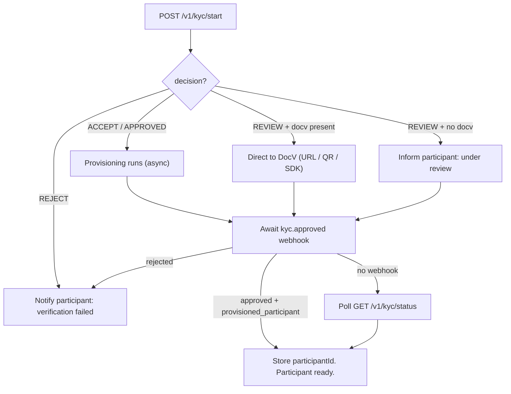

> ## Documentation Index
> Fetch the complete documentation index at: https://docs.polymarket.us/llms.txt
> Use this file to discover all available pages before exploring further.

# Verification Flow

> Submit a participant for KYC and handle each of the four outcomes: instant approval, document verification, manual review, and rejection.

<Warning>
  **BETA — SUBJECT TO CHANGE.** This API is in beta and may change without notice.
</Warning>

`POST /v1/kyc/start` is the primary endpoint for onboarding. You submit the participant's identity data (optionally with a Socure [Digital Intelligence](/partners/onboarding/kyc/digital-intelligence) `session_token`), and the response tells you which of the [four outcomes](/partners/onboarding/kyc/overview#the-four-outcomes) applies.

<Note>
  Every action on this page is also available over gRPC with identical fields and semantics — see [Using gRPC](#using-grpc) and the [transport mapping](/partners/onboarding/kyc/overview#rest-and-grpc). To reduce form friction, the optional [Prefill Flow](/partners/onboarding/kyc/prefill-flow) can pre-populate most of the identity fields before you submit.
</Note>

## Start verification

```bash theme={null}
POST /v1/kyc/start
```

```json theme={null}
{
  "external_id": "your-internal-user-id-123",
  "ssn": "123456789",
  "first_name": "Jane",
  "middle_name": "",
  "last_name": "Smith",
  "date_of_birth": "1990-06-15",
  "email": "jane.smith@example.com",
  "phone_number": "+12125551234",
  "address": {
    "address_line_1": "123 Main St",
    "address_line_2": "Apt 4B",
    "city": "New York",
    "state": "NY",
    "postal_code": "10001",
    "country": "US"
  },
  "agreement": {
    "version": "PMX.ISV.v1.0",
    "signed_at": "2026-04-24T14:30:00Z"
  },
  "session_token": "{socure_di_session_token}",
  "ip_address": "203.0.113.42",
  "docv_eligible": true
}
```

### Request fields

| Field                 | Type    | Required | Description                                                                                                               |
| --------------------- | ------- | -------- | ------------------------------------------------------------------------------------------------------------------------- |
| `external_id`         | string  | Yes      | Your internal identifier for this participant. Max 49 chars, unique per firm. Echoed back in all responses and webhooks.  |
| `ssn`                 | string  | Yes      | Social Security Number, digits only (no dashes)                                                                           |
| `first_name`          | string  | Yes      | Legal first name (max 50)                                                                                                 |
| `middle_name`         | string  | No       | Legal middle name                                                                                                         |
| `last_name`           | string  | Yes      | Legal last name (max 50)                                                                                                  |
| `date_of_birth`       | string  | Yes      | `YYYY-MM-DD`                                                                                                              |
| `email`               | string  | Yes      | Email address                                                                                                             |
| `phone_number`        | string  | Yes      | E.164 format (e.g. `+12125551234`)                                                                                        |
| `address`             | object  | Yes      | Residential address (see below)                                                                                           |
| `agreement.version`   | string  | Yes      | Version of the participant agreement accepted. Confirm the current value with the onboarding team — do not hardcode.      |
| `agreement.signed_at` | string  | Yes      | UTC ISO-8601 timestamp of acceptance                                                                                      |
| `session_token`       | string  | No       | Socure [Digital Intelligence](/partners/onboarding/kyc/digital-intelligence) token — **strongly recommended**             |
| `docv_eligible`       | boolean | No       | Whether this evaluation may use [document verification (DocV)](#document-verification-docv). Omitted = not DocV-eligible. |
| `ip_address`          | string  | Yes      | Participant's IP address                                                                                                  |

### Address object

| Field            | Required | Description                                                                                           |
| ---------------- | -------- | ----------------------------------------------------------------------------------------------------- |
| `address_line_1` | Yes      | Street address                                                                                        |
| `address_line_2` | No       | Apartment, suite, unit                                                                                |
| `city`           | Yes      | City                                                                                                  |
| `state`          | Yes      | Two-letter US state code                                                                              |
| `postal_code`    | Yes      | Five-digit US ZIP code (for example `10001`)                                                          |
| `country`        | No       | Two-letter country code; use `US`. Not validated platform-side — passed to the verification provider. |

## Decision matrix

The response's `status` object carries `decision`, `status`, `subStatus`, and `externalId`. Together with the presence of a `docv` object, the synchronous response indicates the path:

| `decision`            | `docv` present | Meaning                                                                     |
| --------------------- | -------------- | --------------------------------------------------------------------------- |
| `ACCEPT` / `APPROVED` | No             | **Approved** — provisioning runs (often asynchronously; see below)          |
| `REVIEW`              | Yes            | **Document verification** — direct the participant to `docv.url` or the SDK |
| `REVIEW`              | No             | **Manual compliance review** — inform the participant to wait               |
| `RESUBMIT`            | No             | Participant must resubmit documents                                         |
| `REJECT`              | No             | **Rejection** — no account created                                          |

<Warning>
  **Treat `decision` / `status` / `subStatus` as informational, not control flow.** These values are passed through from the verification provider and the provider may emit values beyond the set above. Key your logic off the **`docv` presence** on the start and [status](#resuming-an-interrupted-docv-session) responses, and off the **[webhook](/partners/onboarding/kyc/webhooks) `event_type` / `status`** (`kyc.approved` / `kyc.rejected`) for the terminal outcome.
</Warning>

## Approval

The most common path. Note that **approval is asynchronous even when the decision is instant**: a successful `POST /v1/kyc/start` may return a **non-terminal status** while backend account provisioning completes in the background. `participantId` is **often empty on this response** — you learn the final values from the [`kyc.approved` webhook](/partners/onboarding/kyc/webhooks) and from a later [`GET /v1/kyc/status`](#check-status) read.

<Note>
  You send `snake_case`, but REST responses come back in `camelCase` (protobuf JSON naming) — e.g. `externalId`, `participantId`. See [Field naming](/partners/onboarding/kyc/overview#field-naming).
</Note>

```json theme={null}
{
  "status": {
    "decision": "ACCEPT",
    "status": "ON_HOLD",
    "subStatus": "Accept",
    "externalId": "your-internal-user-id-123"
  },
  "participantId": ""
}
```

A `GET /v1/kyc/status` read before provisioning completes returns empty provisioning identifiers:

```json theme={null}
{
  "status": {
    "decision": "ACCEPT",
    "status": "ON_HOLD",
    "subStatus": "Accept",
    "externalId": "your-internal-user-id-123"
  },
  "participantId": "",
  "provisionedAccount": ""
}
```

Once provisioning completes, `GET /v1/kyc/status` (and the webhook) return the engine-neutral identifiers:

```json theme={null}
{
  "status": {
    "decision": "ACCEPT",
    "status": "CLOSED",
    "subStatus": "Accept",
    "externalId": "your-internal-user-id-123"
  },
  "participantId": "firms/ISV-Participant-YourFirmID/users/your-internal-user-id-123",
  "provisionedAccount": "firms/ISV-YourFirmID/accounts/8f3a2c...e1"
}
```

`provisionedAccount` is the fully qualified DCM account name. Its account identifier is opaque and cannot be derived from participant or user data.

<Info>
  **Automatic provisioning.** On approval, Polymarket US automatically creates the participant's trading identity and account — there is no separate account-creation step (see [Onboard Participants](/partners/onboarding/onboard-participants)). Because provisioning is asynchronous, **wait for the webhook (or a populated `participantId` from status) before enabling trading** rather than assuming the start response carries it.
</Info>

<Note>
  **Persist the account mapping.** At approval time, store the `externalId` → `provisionedAccount` mapping. `provisionedAccount` exactly matches `BalanceLedgerEntry.account` on the [balance ledger stream](/streaming-endpoints/balance-ledger-stream); exact string matching is the only way to attribute those stream entries to a user.
</Note>

<Note>
  **Which field identifies the participant when you trade?** Use `participantId` (the webhook calls the same value `provisioned_participant`) as the [`x-participant-id`](/partners/get-connected/authentication#acting-on-behalf-of-a-participant) header — that is *who* the order is for. `provisionedAccount` identifies the participant's balance-ledger account. Your `externalId` is **your** reference only and is never sent to identify the participant. See [Using these identifiers to trade](/partners/onboarding/kyc/webhooks#using-these-identifiers-to-trade).
</Note>

## Document verification (DocV)

DocV is **opt-in per request** via the `docv_eligible` field:

```json theme={null}
{ "docv_eligible": true, ... }   // this evaluation may use DocV
{ "docv_eligible": false, ... }  // DocV disabled for this evaluation
```

When Socure can't verify from the submitted data alone and the evaluation is DocV-eligible, the response includes a `docv` object. **Detect it by the presence of a non-empty `docv` field** (with `decision: "REVIEW"`).

```json theme={null}
{
  "status": {
    "decision": "REVIEW",
    "status": "ON_HOLD",
    "subStatus": "Document Request Initiated",
    "externalId": "your-internal-user-id-123"
  },
  "docv": {
    "url": "https://verify.socure.com/doc/abc123",
    "qrCode": "data:image/png;base64,...",
    "docvTransactionToken": "dt_abc123...",
    "eventId": "evt_456",
    "sdkKey": ""
  }
}
```

| Field                  | Use                                                                                                                                                                                                                                               |
| ---------------------- | ------------------------------------------------------------------------------------------------------------------------------------------------------------------------------------------------------------------------------------------------- |
| `url`                  | Redirect or embed for browser-based document upload                                                                                                                                                                                               |
| `qrCode`               | Base64 PNG — display on desktop for mobile handoff                                                                                                                                                                                                |
| `docvTransactionToken` | Launch token for the Socure mobile SDK                                                                                                                                                                                                            |
| `sdkKey`               | **Always empty — ignore it.** Initialise the Socure SDK with the SDK key issued by the Polymarket US onboarding team; a [single key initialises both Digital Intelligence and DocV](/partners/onboarding/kyc/digital-intelligence#implementation) |
| `eventId`              | Socure event identifier                                                                                                                                                                                                                           |

You can direct the participant three ways — a **web URL**, a **QR code** for desktop→mobile handoff, or the **native Socure SDK**. Document capture is fully handled by Socure's UI; you don't build capture logic yourself.

<Warning>
  The SDK `onSuccess` callback (or completing the web upload) only means the participant **submitted** documents — not that they were **approved**. After submission, await the [`kyc.approved` webhook](/partners/onboarding/kyc/webhooks) or poll `GET /v1/kyc/status`.
</Warning>

After the participant completes DocV, Socure notifies Polymarket US, which provisions the account (on approval) and sends you the final-decision webhook.

## Manual compliance review

If Socure can't make a determination and no DocV path is available, the response is `REVIEW`/`OPEN` **with no `docv` field**. The Polymarket US compliance team reviews the case.

```json theme={null}
{
  "status": {
    "decision": "REVIEW",
    "status": "OPEN",
    "subStatus": "In Review",
    "externalId": "your-internal-user-id-123"
  }
}
```

Tell the participant their application is under review (typically 1–2 business days) and await the webhook. Implement the [polling fallback](#error-handling--polling) for resilience.

## Rejection

```json theme={null}
{
  "status": {
    "decision": "REJECT",
    "status": "CLOSED",
    "subStatus": "Reject",
    "externalId": "your-internal-user-id-123"
  }
}
```

No account is created. Rejection can also occur **after** DocV or **after** a manual review, in which case you receive a [`kyc.rejected` webhook](/partners/onboarding/kyc/webhooks).

## Check status

Poll the current status with the `external_id` you submitted. The response mirrors the `start` response and includes `participantId` and `provisionedAccount` once provisioned.

```bash theme={null}
GET /v1/kyc/status?external_id=your-internal-user-id-123
```

Partner-relevant `status.status` values:

| `status.status`        | Meaning                                                                                                                 |
| ---------------------- | ----------------------------------------------------------------------------------------------------------------------- |
| `OPEN`                 | In progress (for example, manual review)                                                                                |
| `REVIEW` / `IN REVIEW` | Under review                                                                                                            |
| `ON_HOLD`              | Non-terminal provider status (for example, an instant approval while provisioning completes, or a document-upload step) |
| `CLOSED`               | Terminal — check `decision`                                                                                             |

<Note>
  Values are passed through from the verification provider and may extend beyond this set. Use populated provisioning identifiers (and the [webhook](/partners/onboarding/kyc/webhooks)) as your signal that the participant is ready to trade — not a specific `status` string.
</Note>

### Resuming an interrupted DocV session

Participants may close the browser or app mid-upload. While the evaluation is **paused awaiting document capture**, `GET /v1/kyc/status` returns the same `docv` object as [`POST /v1/kyc/start`](#document-verification-docv), so you can re-present the URL, QR code, or SDK token and let them pick up where they left off.

```json theme={null}
{
  "status": {
    "decision": "REVIEW",
    "status": "ON_HOLD",
    "subStatus": "Document Request Initiated",
    "externalId": "your-internal-user-id-123"
  },
  "docv": {
    "url": "https://verify.socure.com/doc/abc123",
    "qrCode": "data:image/png;base64,...",
    "docvTransactionToken": "dt_abc123...",
    "eventId": "evt_456",
    "sdkKey": ""
  },
  "participantId": "",
  "provisionedAccount": ""
}
```

The fields are identical to the start response — including `sdkKey`, which is [always empty](#document-verification-docv).

`docv` is returned **only while a capture step is genuinely outstanding**. It is absent once the participant finishes uploading, absent on terminal evaluations, and absent on every evaluation that never needed DocV — including the instant-approval `ON_HOLD` shown under [Approval](#approval), which is a *provisioning* hold rather than a document hold. So `docv` presence, not `status.status`, is what tells you a participant still owes documents.

<Warning>
  **The capture URL and transaction token are credentials.** Deliver them only to the participant who owns the evaluation; never log them, cache them in a shared store, or expose them on an endpoint another user can reach.
</Warning>

## Error handling & polling

| HTTP | gRPC               | Meaning                                       | Action                                   |
| ---- | ------------------ | --------------------------------------------- | ---------------------------------------- |
| 200  | OK                 | Success                                       | Process the response                     |
| 400  | INVALID\_ARGUMENT  | Missing or invalid field                      | Fix the request                          |
| 401  | UNAUTHENTICATED    | Invalid/expired token                         | Refresh the token                        |
| 403  | PERMISSION\_DENIED | Firm lacks KYC API access                     | Contact the onboarding team              |
| 409  | ALREADY\_EXISTS    | Participant already has approved KYC          | Fetch via `GET /v1/kyc/status`           |
| 429  | —                  | Throttled at the edge before reaching the API | Retry with backoff (honor `Retry-After`) |
| 500  | INTERNAL           | Gateway error                                 | Retry with exponential backoff           |

<Info>
  **`external_id` is idempotent.** Re-submitting `POST /v1/kyc/start` for a participant who already passed KYC returns `409 ALREADY_EXISTS`. Handle it by fetching the existing status rather than treating it as an error.
</Info>

**Prefer [webhooks](/partners/onboarding/kyc/webhooks) over polling.** As a fallback, poll `GET /v1/kyc/status` every 5–10 seconds for up to 5 minutes after DocV submission. For manual-review cases, poll on a longer cadence (e.g. every 30 minutes for up to 2 business days) and notify the participant asynchronously.

## Using gRPC

The same actions are exposed by `polymarket.us.kyc.v1.KYCAPI` over gRPC (TLS, port 443), authenticated with `authorization: Bearer <token>` metadata. Fields, validation, the decision matrix, and the four outcomes are identical to the REST flow — only the transport differs. Proto stubs are supplied during onboarding.

```protobuf theme={null}
// POST /v1/kyc/start ≡ KYCAPI/StartKYCVerification
message StartKYCVerificationRequest {
  string ssn;
  KYCAddress address;   // address_line_1/2, city, state, postal_code, country
  string date_of_birth; // YYYY-MM-DD
  string phone_number;
  string email;
  string first_name;
  string middle_name;
  string last_name;
  string session_token; // Socure Digital Intelligence
  string external_id;   // your stable inquiry correlation id
  KYCAgreement agreement; // version, signed_at
  optional string referral_code;
  string ip_address;
  optional bool docv_eligible; // opt this evaluation into DocV; unset = not eligible
}
message StartKYCVerificationResponse {
  KYCStatus status;     // decision, status, sub_status, external_id
  KYCDocv docv;         // DocV URL / QR / transaction token when required
  string participant_id;
}

// GET /v1/kyc/status ≡ KYCAPI/GetKYCStatus
message GetKYCStatusRequest { string external_id; }
message GetKYCStatusResponse {
  KYCStatus status;
  string participant_id;
  string provisioned_account; // field 4; field 3 is reserved
  KYCDocv docv;               // field 5; live capture session while DocV is outstanding
}
```

Handle outcomes exactly as described above: key off `docv` presence for the synchronous step and the [webhook](/partners/onboarding/kyc/webhooks) for the terminal outcome. gRPC status codes map to the REST errors in the [table above](#error-handling--polling).

## Outcome flowchart



## Sandbox testing

In sandbox, with **DocV disabled** (`docv_eligible` false or omitted), Socure decides the outcome from the **name and email** you submit:

| Outcome   | How to trigger                                                                                             |
| --------- | ---------------------------------------------------------------------------------------------------------- |
| Rejection | Set `email` to `reject@example.com`                                                                        |
| Review    | Set `first_name` to `Paulina` and `last_name` to `Gizela` (with any email other than `reject@example.com`) |
| Approval  | Use any other name / email combination                                                                     |

With **DocV enabled** (`docv_eligible: true`), sandbox outcomes are driven by the **date of birth** instead:

| Outcome                                              | `date_of_birth` |
| ---------------------------------------------------- | --------------- |
| Immediate approval                                   | `1985-10-02`    |
| Immediate rejection                                  | `1985-09-04`    |
| DocV — approved after upload                         | `1985-09-02`    |
| DocV — rejected after upload                         | `1985-09-05`    |
| DocV — review after upload (pending manual decision) | `1985-09-25`    |

Use these placeholder agreement values in sandbox (the onboarding team provides production values):

| Field                 | Sandbox value          |
| --------------------- | ---------------------- |
| `agreement.version`   | `PMX.ISV.SANDBOX.v1.0` |
| `agreement.signed_at` | Current UTC timestamp  |

## Next steps

<CardGroup cols={2}>
  <Card title="Webhooks" icon="bell" href="/partners/onboarding/kyc/webhooks">
    Receive the async approval/rejection notifications.
  </Card>

  <Card title="Digital Intelligence" icon="shield-halved" href="/partners/onboarding/kyc/digital-intelligence">
    Lower your REVIEW rate with the `session_token`.
  </Card>
</CardGroup>
