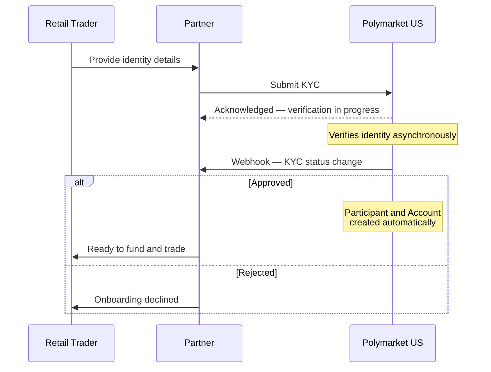

> ## Documentation Index
> Fetch the complete documentation index at: https://docs.polymarket.us/llms.txt
> Use this file to discover all available pages before exploring further.

# Onboard Participants

> How a retail trader becomes a tradable Participant: KYC is the onboarding process, and a Participant and Account are created automatically on approval.

Onboarding a retail trader onto your platform **is the KYC process**. You collect the trader's required information and submit it; Polymarket US performs the identity verification and makes the decision. When KYC is approved, a **Participant** (their trading identity) and an **Account** (their balances and positions) are **created automatically** — there is no separate "create user" or "create account" step.

This section has three parts that fit together:

<CardGroup cols={3}>
  <Card title="KYC Verification" icon="id-card" href="/partners/onboarding/kyc/overview">
    **The process.** Collect and submit identity information; Polymarket US verifies and decides.
  </Card>

  <Card title="Participants" icon="user" href="/partners/onboarding/users">
    **The identity created.** The trading identity you act on behalf of after approval.
  </Card>

  <Card title="Accounts" icon="wallet" href="/partners/onboarding/accounts">
    **The account created.** The container for the participant's balances and positions.
  </Card>
</CardGroup>

## How they fit together

KYC verification is **asynchronous**: you submit the participant's information, and Polymarket US notifies your platform of the decision via a **webhook**. On approval, the Participant and Account already exist and are ready for funding and trading.

1. **You collect** each trader's required details and present the appropriate participant agreement.
2. **You submit** the information through the [KYC](/partners/onboarding/kyc/overview) endpoints.
3. **Polymarket US verifies** the identity asynchronously and makes the decision — you do not perform the verification yourself.
4. **You're notified by [webhook](/partners/onboarding/kyc/webhooks)** when the outcome is terminal. On approval, the `kyc.approved` event carries the participant's `provisioned_account` and `provisioned_participant` once the trading account is provisioned (provisioning is asynchronous, so this can arrive shortly after the initial response).
5. **On approval**, the trader's [Participant](/partners/onboarding/users) identity and [Account](/partners/onboarding/accounts) are already provisioned. Once their account is funded with a [deposit transfer](/partners/funding/deposits-withdrawals) *(Beta)*, they can trade.

<Tip>
  **Prefer the webhook over polling.** Register a [KYC webhook](/partners/onboarding/kyc/webhooks) so your platform is informed the moment a decision is made. An `ACCEPT` decision means the Participant and Account are provisioned for you with no separate setup call, but provisioning is asynchronous: their identifiers arrive on the [`kyc.approved`](/partners/onboarding/kyc/webhooks) event (which can follow shortly after the initial response), so don't assume they're on the first response. You can still fall back to `GET /v1/kyc/status` for one-off checks.
</Tip>

<Info>
  **One process, two results.** Think of KYC as the onboarding action and the Participant and Account as its outputs. You never create them directly — a successful KYC produces both.
</Info>

## Where to go next

<CardGroup cols={2}>
  <Card title="Start with KYC" icon="id-card" href="/partners/onboarding/kyc/overview">
    The verification workflow and document verification.
  </Card>

  <Card title="Set up status webhooks" icon="bell" href="/partners/onboarding/kyc/webhooks">
    Receive the async KYC decision instead of polling.
  </Card>

  <Card title="Act on participants" icon="user-check" href="/partners/onboarding/users">
    Resolve who you can act for and use the `x-participant-id` header.
  </Card>

  <Card title="Funding" icon="building-columns" href="/partners/funding/overview">
    How an approved participant's account is funded *(Beta)*.
  </Card>

  <Card title="End-user legal agreements" icon="file-contract" href="/partners/onboarding/legal-agreements">
    The four documents each trader accepts, the exact acceptance language, and agreement versioning.
  </Card>
</CardGroup>
