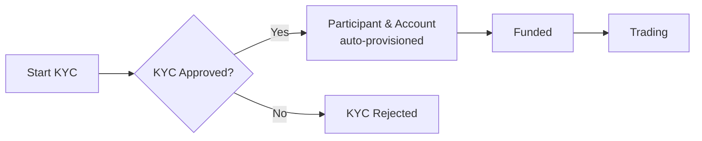

> ## Documentation Index
> Fetch the complete documentation index at: https://docs.polymarket.us/llms.txt
> Use this file to discover all available pages before exploring further.

# Participants

> The lifecycle of a Retail Participant and how to see who your Firm can act on behalf of.

A **Retail Participant** is a person you onboard who trades through your platform. You don't create participants directly — they are **provisioned automatically when KYC is approved** — so your work here is to verify identity and then read back who your Firm can act for.

## Participant lifecycle

When a Retail Participant completes KYC and is approved:

1. Polymarket US automatically provisions their **trading identity** (Participant).
2. A **trading account** is created for them.
3. They can then be funded and trade.

There is no separate "create user" or "create account" call. See the [KYC Verification Flow](/partners/onboarding/kyc/verification-flow) for the steps, and [Partner Funding](/partners/funding/overview) *(Beta)* for how participant trading is funded.

<Info>
  **Terminology.** These docs use **Retail Participant** for the end user. In API payloads the underlying field names use `user`/`users`; treat those as the Retail Participant's trading identity. See the [Glossary](/partners/glossary).
</Info>

## Resolve who you can act for

You discover the identities available to your Firm with three endpoints from the Accounts API. Each links to its full API reference below; the partner-specific usage is summarized here.

| Endpoint           | Use it to                                                   | API reference                                                 |
| ------------------ | ----------------------------------------------------------- | ------------------------------------------------------------- |
| `GET /v1/whoami`   | Confirm your Firm identity and entitlements                 | [Get who am I ↗](/institutional/accounts/overview#endpoints)  |
| `GET /v1/users`    | List the Retail Participants your Firm may act on behalf of | [List users ↗](/institutional/accounts/overview#endpoints)    |
| `GET /v1/accounts` | List the trading accounts you can access                    | [List accounts ↗](/institutional/accounts/overview#endpoints) |

For the account and identity **hierarchy** and entitlements model, see [Accounts & Identity](/trader-guide/accounts-identity).

In partner usage, IDs of the form `firms/your-firm/users/participant-123` are the values you place in the **`x-participant-id`** header to act on behalf of a specific Retail Participant.

<Warning>
  **`GET /v1/users` is a roster read, not your starting point.** It is account-scoped and requires an `x-participant-id` header itself, so it cannot be used to find your first participant ID.

  Each Retail Participant's ID is delivered to you when their KYC reaches `ACCEPT` — as `participantId` on the [`kyc.approved` webhook](/partners/onboarding/kyc/webhooks) or from [`GET /v1/kyc/status`](/partners/onboarding/kyc/verification-flow#check-status). That is the authoritative source; record it against your own user record as you onboard. Use `GET /v1/users` afterwards to reconcile or re-list the Retail Participants your Firm may act for.
</Warning>

<Info>
  Call `GET /v1/whoami` and `GET /v1/users` after authenticating and before trading, so you use the correct participant and account IDs in subsequent requests.
</Info>

## Participant vs Account

| Entity          | Description                                                              |
| --------------- | ------------------------------------------------------------------------ |
| **Participant** | A person with a verified identity (KYC). Has a trading identity ID.      |
| **Account**     | A trading account with balances and positions. Belongs to a Participant. |

A Participant can have multiple accounts for different purposes (e.g., separate trading strategies).

## Related guides

* [Onboard Participants](/partners/onboarding/onboard-participants) — How KYC creates the Participant and Account
* [Accounts & Identity](/trader-guide/accounts-identity) — The account and identity hierarchy
* [KYC Verification](/partners/onboarding/kyc/overview) — Identity verification (provisions participants automatically)
* [Accounts](/partners/onboarding/accounts) — List trading accounts
* [Funding](/partners/funding/overview) — How participant trading is funded *(Beta)*
