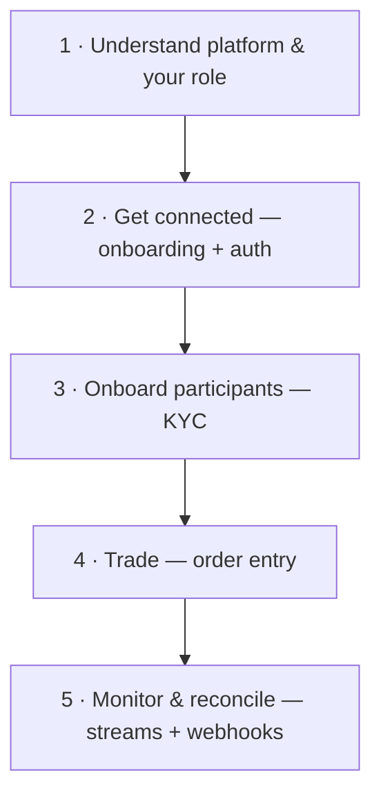

> ## Documentation Index
> Fetch the complete documentation index at: https://docs.polymarket.us/llms.txt
> Use this file to discover all available pages before exploring further.

# Partner Integration

> Build a trading experience on Polymarket US as an Introducing Broker or Independent Software Vendor.

This section is for **Introducing Brokers (IBs)** and **Independent Software Vendors (ISVs)** building a trading experience on Polymarket US. It teaches the **workflow** — how to onboard yourself, onboard and verify your users, fund their trading, place orders, and monitor activity — and points you to the exact APIs and streams for each step.

<Info>
  **New here?** Read [Your Role](/partners/your-role) and the [Platform Model](/partners/platform-model) first, then follow the [Integration Journey](/partners/integration-journey).
</Info>

## The integration journey

## Which partner are you?

<CardGroup cols={3}>
  <Card title="ISV" icon="code" href="/partners/partner-types/isvs">
    An Independent Software Vendor provides the software experience for retail traders. Not a broker.
  </Card>

  <Card title="IB" icon="scale-balanced" href="/partners/partner-types/ibs">
    An Introducing Broker integrates the same way, plus carries CFTC/NFA regulatory obligations.
  </Card>

  <Card title="FCM" icon="building-columns" href="/partners/partner-types/fcms">
    A Futures Commission Merchant connects and clears differently. See the FCM guide.
  </Card>
</CardGroup>

<Note>
  IBs and ISVs **integrate identically** — same APIs and same workflow. The difference is legal classification. FCMs are handled separately.
</Note>

## If you're asking…

| Question                              | Go to                                                    |
| ------------------------------------- | -------------------------------------------------------- |
| "What does a partner actually do?"    | [Your Role](/partners/your-role)                         |
| "How is Polymarket US structured?"    | [Platform Model](/partners/platform-model)               |
| "What's the end-to-end build order?"  | [Integration Journey](/partners/integration-journey)     |
| "How is funding handled?"             | [Partner Funding](/partners/funding/overview) *(Beta)*   |
| "How do I authenticate?"              | [Authentication](/partners/get-connected/authentication) |
| "How do I onboard and verify a user?" | [KYC Verification](/partners/onboarding/kyc/overview)    |
| "How do I place my first order?"      | [Quickstart](/partners/get-connected/quickstart)         |
| "What does a term mean?"              | [Partner Glossary](/partners/glossary)                   |

## Get started

<Card title="Start the Integration Journey" icon="arrow-right" href="/partners/integration-journey">
  The recommended path from onboarding to live trading.
</Card>

<Note>
  **Ready to onboard?** Contact [institutional@polymarket.us](mailto:institutional@polymarket.us) to begin. See [Partner Onboarding](/partners/get-connected/onboarding) for what we need from you and what you'll receive.
</Note>
