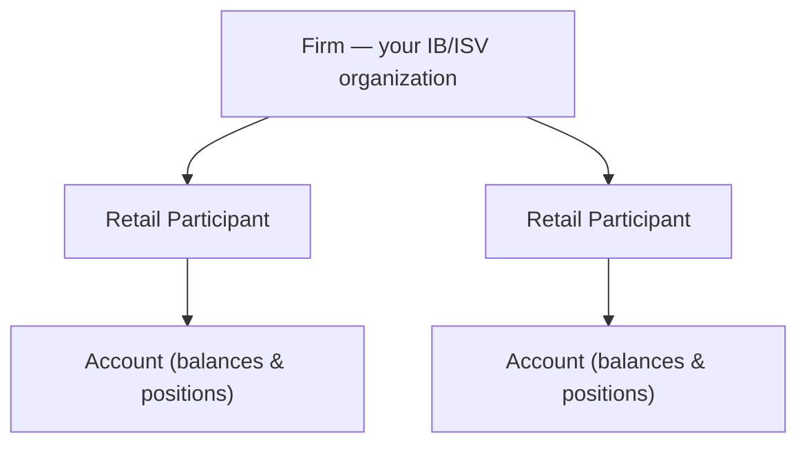
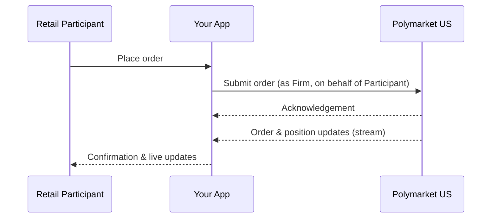

> ## Documentation Index
> Fetch the complete documentation index at: https://docs.polymarket.us/llms.txt
> Use this file to discover all available pages before exploring further.

# Platform Model

> How Polymarket US is structured as a DCM and DCO, and the entity model you integrate against.

Polymarket US operates as a CFTC-regulated **Designated Contract Market (DCM)** and **Derivatives Clearing Organization (DCO)**. As a partner you integrate against a **single platform** — the internal split between matching and clearing is ours to manage, not something your integration needs to model.

<Note>
  **Audience: developers and solution architects.** A conceptual model of the platform and the entities your integration acts on.
</Note>

## One platform, two functions

| Function           | What it does                                                    | What you interact with                 |
| ------------------ | --------------------------------------------------------------- | -------------------------------------- |
| **DCM** (matching) | Maintains the order book, matches orders, publishes market data | Order entry, market data               |
| **DCO** (clearing) | Holds collateral, clears trades, settles contracts              | Balances, positions, funding transfers |

<Info>
  In every diagram and API in these docs, the platform is represented as a single actor: **Polymarket US**. You authenticate once and use one set of credentials regardless of whether a given call is served by the matching or clearing function.
</Info>

## The entity model

Your integration acts on a small, consistent set of entities:

| Entity                 | What it is                                                                | When it's created                               |
| ---------------------- | ------------------------------------------------------------------------- | ----------------------------------------------- |
| **Firm**               | Your IB/ISV organization — the permissions container you authenticate as  | At partner onboarding                           |
| **Retail Participant** | A person you onboard who trades through your platform                     | Automatically, when their KYC is approved       |
| **Account**            | The trading account holding a Retail Participant's balances and positions | Automatically, alongside the Retail Participant |

You authenticate as the **Firm** and act **on behalf of** the Retail Participants beneath it. You **collect** each participant's KYC information and submit it; Polymarket US **performs the verification and decision**. On approval, identity and accounts are **provisioned automatically** — there is no separate "create user" or "create account" call.

<Note>
  In these partner docs, **Participant** means a *trading identity* — a person you onboard. Be aware the [main glossary](/getting-started/glossary) also uses the word "participant" in an unrelated market-structure sense; the [Partner Glossary](/partners/glossary) explains the distinction.
</Note>

## How messages flow

A typical action — placing an order on behalf of a Retail Participant — looks like this from the outside:

Your application is the bridge: you translate participant actions into authenticated requests, and translate Polymarket US streams back into your UI.

## Identifying who you act for

API calls that are scoped to a participant carry an `x-participant-id` header identifying which Retail Participant the action is for. You can discover the identities available to your Firm at any time:

* [`GET /v1/whoami`](/institutional/accounts/overview#endpoints) — your Firm identity
* [`GET /v1/users`](/institutional/accounts/overview#endpoints) — the Retail Participants your Firm may act on behalf of

See [Accounts & Identity](/trader-guide/accounts-identity) for the identity hierarchy, or [Onboard Participants](/partners/onboarding/onboard-participants) for how identities are created and listed.

## Next steps

<CardGroup cols={2}>
  <Card title="Integration Journey" icon="map" href="/partners/integration-journey">
    The recommended order to build your integration.
  </Card>

  <Card title="Authentication" icon="key" href="/partners/get-connected/authentication">
    Authenticate as your Firm with Private Key JWT.
  </Card>
</CardGroup>
