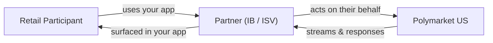

> ## Documentation Index
> Fetch the complete documentation index at: https://docs.polymarket.us/llms.txt
> Use this file to discover all available pages before exploring further.

# Your Role as a Partner

> How IBs and ISVs integrate with Polymarket US as message facilitators — what you do, what we do, and what you never have to handle.

As an Introducing Broker (IB) or Independent Software Vendor (ISV), you integrate with Polymarket US as a **message facilitator**: you authenticate as a **Firm**, act on behalf of the **Retail Participants** you onboard, and route their activity to and from the exchange. You build the experience; Polymarket US runs the regulated market and clearing.

<Info>
  **You never hold participant funds.** Participant accounts are funded by your **funding entity** through [Partner Funding](/partners/funding/overview) *(Beta)* — deposits and withdrawals that mirror each participant's wallet allocation. Your role is to onboard and verify participants, route their orders, and relay transfer instructions — never to custody funds.
</Info>

## What you do vs. what Polymarket US does

| Responsibility                                                    | You (Partner)                                           | Polymarket US                      |
| ----------------------------------------------------------------- | ------------------------------------------------------- | ---------------------------------- |
| Onboard Retail Participants (collect details, present agreements) | ✅                                                       | —                                  |
| Collect KYC information and submit it                             | ✅                                                       | —                                  |
| Verify identity and decide (KYC)                                  | —                                                       | ✅ Performs verification & decision |
| Provision trading identities and accounts                         | —                                                       | ✅ Automatic on KYC approval        |
| Present markets, prices, and a trading UI                         | ✅                                                       | —                                  |
| Match orders and maintain the order book                          | —                                                       | ✅ (DCM)                            |
| Hold collateral, clear, and settle                                | —                                                       | ✅ (DCO)                            |
| Monitor orders, positions, balances                               | ✅ Consume [streams](/streaming-endpoints/grpc-overview) | ✅ Emit streams                     |

## You are a facilitator, not a counterparty

Every message you send is **on behalf of a Retail Participant** you have onboarded. You are a permissions and routing layer:

* You authenticate **once** as your Firm and act for any Retail Participant under it.
* Polymarket US matches, clears, and settles — you never take the other side of a trade.
* Funding of participant trading accounts flows between your funding entity and each participant's account — see [Partner Funding](/partners/funding/overview) *(Beta)*.

## ISV or IB?

The two partner types **integrate identically** — the same APIs and the same workflow. The difference is legal classification, not mechanics.

<CardGroup cols={2}>
  <Card title="ISV" icon="code" href="/partners/partner-types/isvs">
    An Independent Software Vendor provides the software experience. ISVs are **not** brokers and carry no broker registration.
  </Card>

  <Card title="IB" icon="scale-balanced" href="/partners/partner-types/ibs">
    An Introducing Broker integrates the same way **plus** carries CFTC registration and NFA membership obligations.
  </Card>
</CardGroup>

<Warning>
  **IB-specific obligations.** If you are an Introducing Broker, you must maintain CFTC registration, NFA membership, and the supervisory/compliance requirements described on the [IBs](/partners/partner-types/ibs) page **in addition to** completing this integration. These are regulatory obligations, not technical ones.
</Warning>

## Next steps

<CardGroup cols={2}>
  <Card title="Platform Model" icon="sitemap" href="/partners/platform-model">
    How the DCM and DCO fit together, and the entities you act on.
  </Card>

  <Card title="Integration Journey" icon="map" href="/partners/integration-journey">
    The end-to-end path from onboarding to live trading.
  </Card>
</CardGroup>
