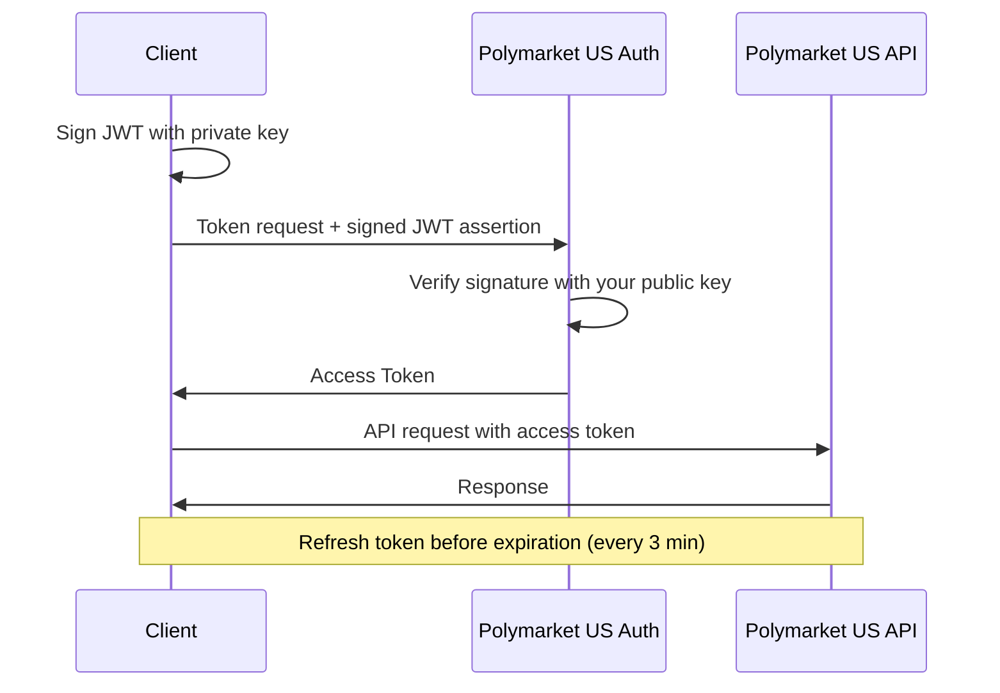

> ## Documentation Index
> Fetch the complete documentation index at: https://docs.polymarket.us/llms.txt
> Use this file to discover all available pages before exploring further.

# Authentication

> How to authenticate with the Polymarket Exchange API using Private Key JWT

The Polymarket Exchange API uses **Private Key JWT** authentication. You sign a JWT with your private key, exchange it for an access token, then include that token in every API request.

<Warning>
  **CRITICAL: Access tokens must be refreshed every 3 minutes.**

  Access tokens have a short expiration. Your application MUST implement automatic token refresh before expiration to maintain uninterrupted API and streaming connections.
</Warning>

## Authentication Flow



## Authentication Configuration

### Auth Domains

| Environment        | Auth Domain                |
| ------------------ | -------------------------- |
| **Pre-production** | `pmx-preprod.us.auth0.com` |
| **Production**     | `pmx-prod.us.auth0.com`    |

During onboarding, you'll provide your **public key** and receive your `client_id` and `audience` values.

## Step 1: Create Client Assertion JWT

Create a JWT with these claims, signed with your private key using RS256:

```json theme={null}
{
  "iss": "YOUR_CLIENT_ID",
  "sub": "YOUR_CLIENT_ID",
  "aud": "https://pmx-preprod.us.auth0.com/oauth/token",
  "iat": 1703270400,
  "exp": 1703270700,
  "jti": "unique-uuid-per-request"
}
```

## Step 2: Request Access Token

Exchange your signed JWT for an access token:

```bash theme={null}
curl --request POST \
  --url "https://pmx-preprod.us.auth0.com/oauth/token" \
  --header "content-type: application/json" \
  --data '{
    "client_id": "YOUR_CLIENT_ID",
    "client_assertion_type": "urn:ietf:params:oauth:client-assertion-type:jwt-bearer",
    "client_assertion": "YOUR_SIGNED_JWT_ASSERTION",
    "audience": "YOUR_API_AUDIENCE",
    "grant_type": "client_credentials"
  }'
```

### Response

```json theme={null}
{
  "access_token": "eyJhbGciOiJSUzI1NiIsInR5cCI6IkpXVCIs...",
  "token_type": "Bearer",
  "expires_in": 180
}
```

<Info>
  The `expires_in` value is in seconds. With a 3-minute (180 second) expiration, you must refresh tokens frequently.
</Info>

## Step 3: Use Token in API Requests

Include the access token in the `Authorization` header for every request.

### gRPC Streaming

Include the token in gRPC metadata:

```python theme={null}
import grpc
from polymarket.v1 import marketdatasubscription_pb2_grpc

# Create secure channel
credentials = grpc.ssl_channel_credentials()
channel = grpc.secure_channel('grpc-api.preprod.polymarketexchange.com:443', credentials)

# Create stub
stub = marketdatasubscription_pb2_grpc.MarketDataSubscriptionAPIStub(channel)

# Include access token in metadata
metadata = [
    ('authorization', f'Bearer {access_token}')
]

# Make streaming call with metadata
response_stream = stub.CreateMarketDataSubscription(request, metadata=metadata)
```

<Warning>
  The metadata key **must** be `authorization` (lowercase). Include `Bearer ` prefix before the token.
</Warning>

## Token Refresh Strategy

Since tokens expire every 3 minutes, implement automatic refresh:

```python theme={null}
import jwt
import uuid
import time
import requests
from cryptography.hazmat.primitives import serialization

class TokenManager:
    def __init__(self, auth0_domain, client_id, audience, private_key_path):
        self.auth0_domain = auth0_domain
        self.client_id = client_id
        self.audience = audience
        self.private_key_path = private_key_path
        self.token = None
        self.expires_at = None

    def _load_private_key(self):
        with open(self.private_key_path, 'rb') as f:
            return serialization.load_pem_private_key(f.read(), password=None)

    def _create_client_assertion(self):
        private_key = self._load_private_key()
        now = int(time.time())
        claims = {
            "iss": self.client_id,
            "sub": self.client_id,
            "aud": f"https://{self.auth0_domain}/oauth/token",
            "iat": now,
            "exp": now + 300,
            "jti": str(uuid.uuid4()),
        }
        return jwt.encode(claims, private_key, algorithm="RS256")

    def get_token(self):
        # Refresh if token is missing or expires within 30 seconds
        if not self.token or time.time() >= self.expires_at - 30:
            self._refresh_token()
        return self.token

    def _refresh_token(self):
        assertion = self._create_client_assertion()
        response = requests.post(
            f"https://{self.auth0_domain}/oauth/token",
            json={
                "client_id": self.client_id,
                "client_assertion_type": "urn:ietf:params:oauth:client-assertion-type:jwt-bearer",
                "client_assertion": assertion,
                "audience": self.audience,
                "grant_type": "client_credentials"
            }
        )
        response.raise_for_status()
        data = response.json()

        self.token = data["access_token"]
        self.expires_at = time.time() + data["expires_in"]

# Usage
token_manager = TokenManager(
    auth0_domain="pmx-preprod.us.auth0.com",
    client_id="YOUR_CLIENT_ID",
    audience="YOUR_API_AUDIENCE",
    private_key_path="/path/to/private_key.pem"
)

# Always use get_token() - it handles refresh automatically
token = token_manager.get_token()
```

**Required packages:**

```bash theme={null}
pip install PyJWT cryptography requests
```

## Handling Authentication Errors

### Common Authentication Errors

| Error Code                 | Description                           | Solution                                                                                                                                          |
| -------------------------- | ------------------------------------- | ------------------------------------------------------------------------------------------------------------------------------------------------- |
| `invalid_client`           | JWT signature verification failed     | Verify private key matches registered public key                                                                                                  |
| `invalid_client_assertion` | Malformed JWT or wrong claims         | Check JWT claims (iss, sub, aud, exp, jti)                                                                                                        |
| `UNAUTHENTICATED`          | Access token invalid or expired       | Refresh token and retry                                                                                                                           |
| `PERMISSION_DENIED`        | Token valid but lacks required scopes | Add the missing scope to your Auth0 application and request a fresh token. The error body is `permission denied: missing required scope <scope>`. |
| `UNAVAILABLE`              | Cannot reach authentication service   | Check network connectivity, retry with backoff                                                                                                    |

### Streaming Scopes

Scopes are enforced on streaming RPCs the same way they are on REST endpoints. The most common gRPC streams and their required scopes:

| RPC                               | Required Scope    |
| --------------------------------- | ----------------- |
| `CreateMarketDataSubscription`    | `read:marketdata` |
| `BiDirectionalStreamMarketData`   | `read:marketdata` |
| `CreateOrderSubscription`         | `read:orders`     |
| `StreamRFQEvents`                 | `read:orders`     |
| `CreatePositionSubscription`      | `read:positions`  |
| `CreateBalanceLedgerSubscription` | `read:positions`  |
| `CreateDropCopySubscription`      | `read:dropcopy`   |
| `CreateFundingSubscription`       | `read:funding`    |

See the full scope reference in the [trader guide authentication page](/trader-guide/authentication#api-scopes).

## Key Rotation

You can rotate your keys without downtime:

1. Generate a new key pair
2. Submit the new public key to us
3. We add the new key (both old and new work during transition)
4. Update your systems to use the new private key
5. Notify us to remove the old public key

## Next Steps

<CardGroup cols={2}>
  <Card title="Authentication Setup" icon="key" href="/trader-guide/authentication">
    Complete onboarding guide with key generation
  </Card>

  <Card title="Market Data Streaming" icon="chart-line" href="/streaming-endpoints/market-data-stream">
    Learn how to stream market data
  </Card>

  <Card title="Order Streaming" icon="file-invoice" href="/streaming-endpoints/order-stream">
    Subscribe to order updates
  </Card>

  <Card title="Error Handling" icon="triangle-exclamation" href="/streaming-endpoints/error-handling">
    Handle errors and implement reconnection
  </Card>
</CardGroup>
