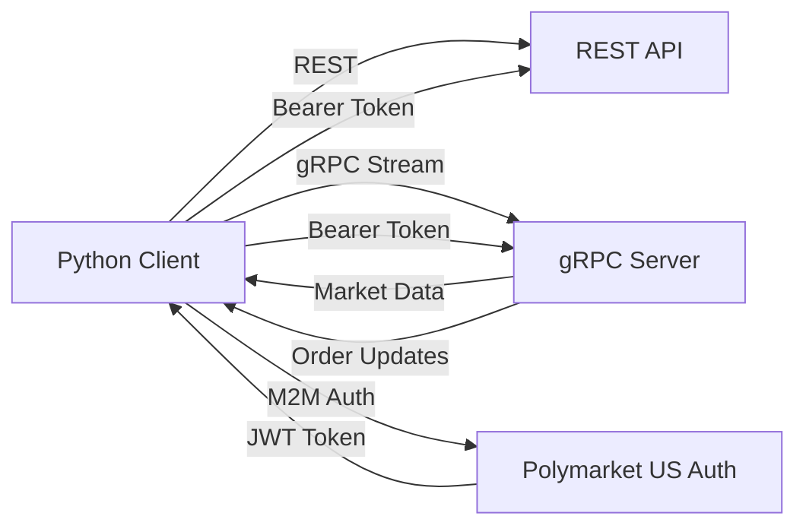

> ## Documentation Index
> Fetch the complete documentation index at: https://docs.polymarket.us/llms.txt
> Use this file to discover all available pages before exploring further.

# gRPC Streaming Overview

> Introduction to real-time data streaming on Polymarket Exchange

The Polymarket Exchange provides **gRPC streaming services** for real-time market data and order execution updates. This enables low-latency, efficient data delivery for applications that need continuous updates.

## Why Use gRPC Streaming?

gRPC streaming offers several advantages:

* **Bidirectional Communication**: Server can push updates without client polling
* **Type Safety**: Strongly-typed messages defined in Protocol Buffers
* **Real-time Updates**: Receive market data and order updates as they happen

## REST + gRPC Hybrid Approach

<Note>
  Most participants use **REST for requests** and **gRPC for streaming**. This hybrid approach combines the simplicity of REST with the efficiency of gRPC streaming.
</Note>

### Typical Integration Pattern

1. **REST API** - Used for:
   * Placing orders (`/v1/trading/orders`)
   * Canceling orders (`/v1/trading/orders/cancel`)
   * Querying account information
   * One-time data requests

2. **gRPC Streaming** - Used for:
   * Real-time market data updates
   * Live order execution reports
   * Continuous position monitoring
   * Order book changes

## Available Streaming Services

### Market Data Streaming

Subscribe to real-time market data updates including:

* Order book (bids and offers)
* Instrument state changes
* Trade statistics (last price, OHLC, volume)
* Open interest

**Service:** `MarketDataSubscriptionAPI.CreateMarketDataSubscription`

[Learn more about Market Data Streaming →](/streaming-endpoints/market-data-stream)

### Order Execution Streaming

Subscribe to real-time order and execution updates:

* New order confirmations
* Partial and complete fills
* Order cancellations and rejections
* Execution reports with trade details

**Service:** `OrderEntryAPI.CreateOrderSubscription`

[Learn more about Order Streaming →](/streaming-endpoints/order-stream)

### RFQ Events Streaming

Subscribe to live combo RFQ and quote lifecycle events:

* RFQ creation and closure
* Quote creation, deletion, acceptance, confirmation, and execution

**Service:** `RFQAPI.StreamRFQEvents`

[Learn more about RFQ Events Streaming →](/streaming-endpoints/rfq-events-stream)

## Server Endpoints

### Pre-Production Environment

```
grpc-api.preprod.polymarketexchange.com:443
```

### Production Environment

```
grpc-api.prod.polymarketexchange.com:443
```

<Info>
  Both endpoints use **TLS/SSL** for secure communication. All connections must be encrypted.
</Info>

## Protocol Buffer Definitions

The exchange uses **Protocol Buffers (proto3)** to define message structures. Download the canonical [Polymarket - Proto Files.zip](https://drive.google.com/uc?export=download\&id=1oT9gaeBEn0vukHD9GOoj_YvzPnR3otng) bundle.

Do not make client startup depend on gRPC reflection. Reflection availability can differ by environment.

### Package Structure

```
polymarket.v1                       # Core services
├── MarketDataSubscriptionAPI       # Market data streaming
├── OrderEntryAPI                   # Order streaming and entry
├── ComboAPI                        # Combo instrument creation and reads
├── RFQAPI                          # Combo RFQs, quotes, and RFQ event streaming
├── RefDataAPI                      # Reference data (instruments, symbols)
├── AccountsAPI                     # Account information
├── PositionAPI                     # Positions and balances
├── ReportAPI                       # Order and trade reports
├── DropCopyAPI                     # Trade execution feed
```

## Quick Start

Ready to get started? Follow our [Getting Started Guide](/streaming-endpoints/getting-started) to:

1. Install Python gRPC libraries
2. Obtain and compile proto files
3. Authenticate and connect
4. Subscribe to your first data stream

## Architecture Overview



### Authentication Flow

1. **Obtain JWT Token**: Request M2M token using client credentials
2. **Attach Token**: Include token in gRPC metadata as `authorization` header
3. **Stream Data**: Receive continuous updates over persistent connection

[Learn more about Authentication →](/streaming-endpoints/authentication)

## Rate Limits

The limits below apply to streaming connections. Unary gRPC order-entry calls are limited separately — see [Institutional Order Entry](/trader-guide/rate-limits#institutional-order-entry) for the per-method, per-tier rates.

| Setting                                             | Value       |
| --------------------------------------------------- | ----------- |
| Max concurrent streams per firm                     | 20          |
| Ingress message rate (per firm, across all streams) | 100 msg/sec |
| `StreamRFQEvents` new stream opens per firm         | 1/sec       |
| Egress (server to client)                           | Unlimited   |

<Warning>
  **Ingress Rate Limit**

  Client-to-server messages are limited to **100 messages per second** across all streams per firm, averaged over a 1-minute window. Short bursts above this rate are allowed. This applies to requests you send, not to server-pushed updates like market data. Exceeding the average limit will result in throttled or rejected messages.
</Warning>

Streaming limits are flat and apply to all participants — they are not tiered. The `StreamRFQEvents` limit is checked only when opening a stream and does not limit server-pushed RFQ or quote events on an established stream, so reconnect with backoff.

See [Rate Limits](/trader-guide/rate-limits) for the full picture, including tiered order entry and the [contract volume share](/trader-guide/rate-limits#volume-share-and-tier-requirements) that determines your tier.

## Key Concepts

### Heartbeats

Periodic keep-alive messages ensure connection health. If heartbeats stop, the connection may be stale.

### Snapshots

Initial state of data (e.g., all open orders) sent when subscription starts.

### Updates

Incremental changes streamed continuously after the snapshot.

### Session IDs

Unique identifiers for each streaming session, useful for logging and debugging.

## Next Steps

<CardGroup cols={2}>
  <Card title="Best Practices" icon="list-check" href="/streaming-endpoints/streaming-best-practices">
    One long-lived stream per feed. Do not reconnect-cancel.
  </Card>

  <Card title="Getting Started" icon="rocket" href="/streaming-endpoints/getting-started">
    Set up your first gRPC stream
  </Card>

  <Card title="Authentication" icon="key" href="/streaming-endpoints/authentication">
    Learn how to authenticate gRPC connections
  </Card>

  <Card title="Market Data" icon="chart-line" href="/streaming-endpoints/market-data-stream">
    Stream real-time market data
  </Card>

  <Card title="Order Updates" icon="file-invoice" href="/streaming-endpoints/order-stream">
    Subscribe to order execution updates
  </Card>

  <Card title="RFQ Events" icon="shuffle" href="/streaming-endpoints/rfq-events-stream">
    Subscribe to combo RFQ and quote events
  </Card>
</CardGroup>
