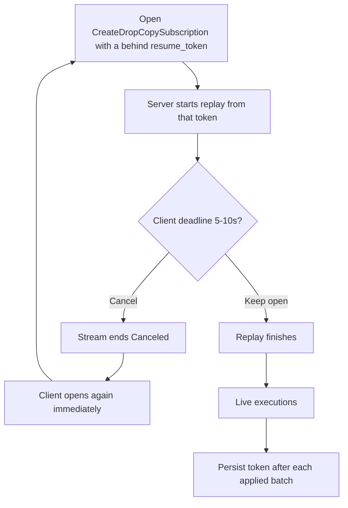

> ## Documentation Index
> Fetch the complete documentation index at: https://docs.polymarket.us/llms.txt
> Use this file to discover all available pages before exploring further.

# Streaming Best Practices

> Keep gRPC streams long-lived. One Drop Copy per firm. Persist resume_token after you apply. Do not cancel mid-replay.

gRPC streams on Polymarket US are **long-lived connections**. Open the stream, keep it open, and apply every message. A reconnect is for a dropped connection, not a polling loop.

<Warning>
  **A short deadline on Drop Copy is not a reconnect strategy.**

  Opening `CreateDropCopySubscription` every few seconds and cancelling it a few seconds later never catches up. Each reconnect starts a replay from your last `resume_token`. If you cancel before that replay finishes, the next connect starts the same replay again.

  Do not put a 5–10 second deadline on a streaming RPC. Do not open one Drop Copy stream per order. The request has no order id.
</Warning>

<CardGroup cols={3}>
  <Card title="One Drop Copy" icon="copy">
    Empty `symbols` is the whole firm. One leader-elected consumer per environment.
  </Card>

  <Card title="Commit, then resume" icon="floppy-disk">
    Persist `resume_token` only after every execution in that batch is durable. Dedup on `execution.id`.
  </Card>

  <Card title="20 streams total" icon="layer-group">
    The 20 concurrent-stream budget is pooled across **all** gRPC subscriptions, not 20 per RPC.
  </Card>
</CardGroup>

## How many streams

| RPC                                       | How many                       | Why                                                                                                   |
| ----------------------------------------- | ------------------------------ | ----------------------------------------------------------------------------------------------------- |
| `CreateDropCopySubscription`              | **1** per firm per environment | Firm-wide executions. `symbols=[]` is all symbols. There is no order-id filter.                       |
| `CreateTradeCaptureReportSubscription`    | **1**                          | Same shape as Drop Copy.                                                                              |
| `CreatePositionChangeSubscription`        | **1**                          | Firm-wide position changes.                                                                           |
| `CreateInstrumentStateChangeSubscription` | **1**                          | Current snapshot, then live state. Reconnect gets a fresh snapshot.                                   |
| `CreateOrderSubscription`                 | **1**                          | Empty `symbols` is all symbols for the requested accounts. **No** 1000-symbol cap.                    |
| `CreateMarketDataSubscription`            | As few as possible             | **1000 symbols per stream.** Empty list is the full universe. Extra streams count against the 20 cap. |
| `BiDirectionalStreamMarketData`           | 1 when the symbol set changes  | Add or remove symbols on the same connection. Do not open a new stream per symbol.                    |
| `CreateBalanceLedgerSubscription`         | 1 **per account**              | Per-account today. Each one counts toward 20. Do not open one per customer at scale.                  |
| `StreamRFQEvents`                         | 1                              | New opens are limited to **1 per firm per second**.                                                   |

Full numbers: [Rate Limits](/trader-guide/rate-limits#grpc-streaming).

<Tip>
  Need market data on more than 1000 symbols? Do **not** open 80 streams. Use `symbols=[]` for the full book, or one [bidirectional market-data](/streaming-endpoints/market-data-stream) stream and add symbols there. Stay inside the **20** concurrent-stream budget for Drop Copy, orders, ledger, RFQ, and market data **together**.
</Tip>

## Snapshot vs resume

Not every stream starts with a snapshot. Do not copy a snapshot client onto Drop Copy.

| Stream                                      | On connect                                                | After a drop                                                                     |
| ------------------------------------------- | --------------------------------------------------------- | -------------------------------------------------------------------------------- |
| Drop Copy / trade capture / position change | **No snapshot.** Live (or replay from token).             | Pass the last **committed** `resume_token`. Dedup `execution.id` / trade id.     |
| Order stream                                | Snapshot of open orders, then updates. No `resume_token`. | Reconnect. Take the new snapshot.                                                |
| Market data                                 | Snapshot, then updates (`snapshot_only: false`).          | Reconnect. Take the new snapshot.                                                |
| Instrument state change                     | Current-state snapshot (paged), then live updates.        | Reconnect. Take the new snapshot. Do not depend on catching up via an old token. |
| Balance ledger                              | Replay from `resume_time`, then live.                     | Pass the last applied `update_time`.                                             |

Unary reads (`SearchExecutions`, `SearchTrades`, `GetOrderBook`) are **anchors**, not a substitute for the stream. See [Reconciliation](/partners/reconciliation).

## The reconnect-cancel loop



<AccordionGroup>
  <Accordion title="What goes wrong">
    A behind `resume_token` is normal after a restart. The server replays from that point up to live. Replay can take longer than a few seconds.

    If the client sets a short RPC deadline, or a 10-second “no message means dead” timer that fires during replay, it cancels the stream. The next connect uses the same behind token. Replay starts over. You never reach live, and the exchange keeps replaying.
  </Accordion>

  <Accordion title="What to do instead">
    1. Open **one** Drop Copy stream with `symbols=[]`.
    2. Do **not** set a per-RPC timeout of a few seconds.
    3. Apply each batch, then persist `response.resume_token`.
    4. On `UNAVAILABLE` or a real disconnect, back off and reconnect with that token.
    5. Treat `CANCELLED` you caused (process restart, deadline) as your bug, not a signal to hammer reconnect.
  </Accordion>
</AccordionGroup>

## Do / don't

<Tabs>
  <Tab title="Drop Copy">
    | Do                                                          | Don't                                      |
    | ----------------------------------------------------------- | ------------------------------------------ |
    | One long-lived `CreateDropCopySubscription` per environment | One stream per order, per user, or per pod |
    | `symbols=[]` for the firm                                   | Fan out a stream per symbol “to go faster” |
    | Persist `resume_token` **after** durable apply              | Persist the token, then crash before apply |
    | Dedup on `execution.id`                                     | Assume exactly-once delivery               |
    | Reconnect only after the TCP/gRPC stream actually died      | Cancel at 5–10s and open again             |
    | Leader-elect if you run many replicas                       | Every replica opens the same stream        |
  </Tab>

  <Tab title="Market data">
    | Do                                                                                           | Don't                                                       |
    | -------------------------------------------------------------------------------------------- | ----------------------------------------------------------- |
    | `snapshot_only: false` for a live book                                                       | Poll `snapshot_only: true` in a tight loop                  |
    | At most **1000** symbols per `CreateMarketDataSubscription`                                  | Send 1000+ and expect a stream (that is `INVALID_ARGUMENT`) |
    | Empty `symbols` or one bidirectional stream for a large universe                             | Open tens of MD streams and blow the 20 cap                 |
    | Open extra MD streams **one after another** if you must split                                | Burst-open every stream at once                             |
    | [KeepAlive](/streaming-endpoints/market-data-stream) every 30–60 min on **bidirectional** MD | Send keepalive on server-streaming MD (not used there)      |
  </Tab>

  <Tab title="Orders and ledger">
    | Do                                                    | Don't                                                              |
    | ----------------------------------------------------- | ------------------------------------------------------------------ |
    | One `CreateOrderSubscription` with empty `symbols`    | Copy the MD 1000-symbol cap onto orders                            |
    | Reconnect order stream and take the snapshot          | Look for an order-stream `resume_token` (there isn't one)          |
    | One ledger stream per **account** you must watch live | One ledger stream per customer when you have thousands of accounts |
    | Persist ledger `update_time` as `resume_time`         | Re-fetch the full ledger on every process restart                  |
  </Tab>
</Tabs>

<Note>
  `CreateOrderSubscription` over 1000 symbols is **not** the market-data cap. Market data over 1000 is `INVALID_ARGUMENT` (`at most 1000 symbols per subscription`). Hitting `RESOURCE_EXHAUSTED` on a stream is the **20 concurrent-stream** budget, ingress rate, or a too-large message — not the 1000 check. Details: [Order stream](/streaming-endpoints/order-stream).
</Note>

## Limits that matter here

| Limit                                  | Value                       | If you exceed it                                                       |
| -------------------------------------- | --------------------------- | ---------------------------------------------------------------------- |
| Concurrent gRPC streams per firm       | **20** pooled               | `RESOURCE_EXHAUSTED`                                                   |
| Ingress (client → server), all streams | 100 msg/s, 1-minute average | Throttle / reject                                                      |
| Egress (server → client)               | Unlimited                   | —                                                                      |
| Market data symbols per stream         | 1000                        | `INVALID_ARGUMENT`                                                     |
| `StreamRFQEvents` new opens            | 1/sec                       | Open-rate limit                                                        |
| Access token lifetime                  | 180 seconds                 | Refresh **credentials**. Do not cancel a healthy stream to rotate JWT. |

See [Rate Limits](/trader-guide/rate-limits#grpc-streaming) and [Authentication](/streaming-endpoints/authentication).

<Warning>
  Access tokens expire in **3 minutes**. Refresh the token in the background. Use the new token on the **next** connect. Do not tear down a live stream every 3 minutes to “re-auth.” The streaming RPC is authenticated when it starts.
</Warning>

## Client shape

### Wrong

```python theme={null}
# Short deadline on a streaming RPC. Cancels during replay.
stub.CreateDropCopySubscription(
    request,
    metadata=metadata,
    timeout=10,  # seconds — too short for replay
)
```

```python theme={null}
# One stream per order. CreateDropCopySubscription has no order id.
for order_id in open_orders:
    stub.CreateDropCopySubscription(request, metadata=metadata)
```

### Right

```python theme={null}
import time
import grpc
from polymarket.v1 import dropcopy_pb2
from polymarket.v1 import dropcopy_pb2_grpc

# last_token: bytes persisted after the previous batch was applied
# persist_resume_token / refresh_auth_metadata / apply_batch: your code

def run_dropcopy(stub, metadata, last_token: bytes, apply_batch):
    request = dropcopy_pb2.CreateDropCopySubscriptionRequest(
        resume_token=last_token or b"",
        symbols=[],  # whole firm
    )
    # No per-RPC timeout. The stream is the session.
    stream = stub.CreateDropCopySubscription(request, metadata=metadata)
    for response in stream:
        apply_batch(response.executions)          # durable write + dedup execution.id
        if response.resume_token:
            last_token = bytes(response.resume_token)
            persist_resume_token(last_token)      # only after apply succeeded
    return last_token

def connect_forever(stub, metadata, last_token: bytes, apply_batch):
    backoff = 1
    while True:
        try:
            last_token = run_dropcopy(stub, metadata, last_token, apply_batch)
            backoff = 1
        except grpc.RpcError as e:
            if e.code() == grpc.StatusCode.UNAUTHENTICATED:
                metadata = refresh_auth_metadata()
                continue
            if e.code() != grpc.StatusCode.UNAVAILABLE:
                raise
            time.sleep(backoff)
            backoff = min(backoff * 2, 30)
```

`apply_batch` must be idempotent. Delivery is **at-least-once**. Use `execution.id` (and `trade_id` on fills) as the unique key.

## FIX Drop Copy

If you consume fills on FIX instead of gRPC, that is **one** Drop Copy session, not a gRPC stream per order. See [FIX Drop Copy](/institutional/fix-api/fix-drop-copy-overview). Do not run a reconnecting gRPC Drop Copy **and** a FIX DC session against the same work unless you can dedup.

## Related

<CardGroup cols={2}>
  <Card title="Drop Copy stream" icon="copy" href="/streaming-endpoints/dropcopy-stream">
    Executions, trade capture, state change, positions
  </Card>

  <Card title="Reconciliation" icon="scale-balanced" href="/partners/reconciliation">
    Streams first, unary reads as anchors
  </Card>

  <Card title="Market data stream" icon="chart-line" href="/streaming-endpoints/market-data-stream">
    1000-symbol cap, snapshot vs live, keepalive
  </Card>

  <Card title="Rate limits" icon="gauge-high" href="/trader-guide/rate-limits">
    20 streams, 100 msg/s ingress, RFQ open rate
  </Card>
</CardGroup>
