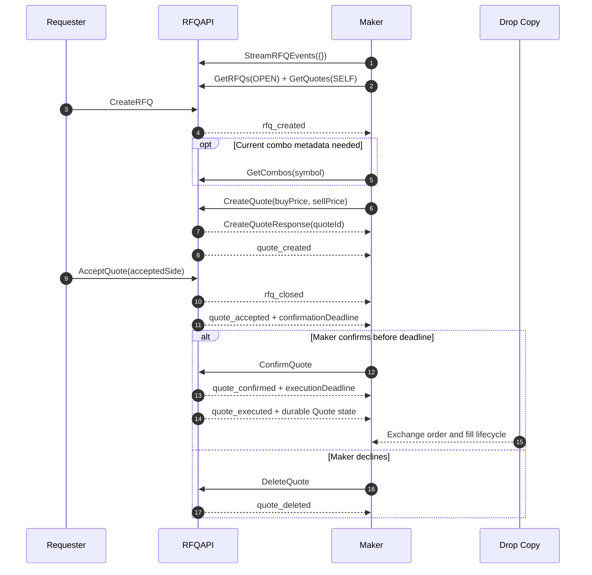

> ## Documentation Index
> Fetch the complete documentation index at: https://docs.polymarket.us/llms.txt
> Use this file to discover all available pages before exploring further.

# Combos

> Quote combo requests distributed through the RFQ API

> REST and gRPC unary calls are supported. RFQ events are gRPC-only. FIX support is coming later.

A combo is an instrument with 2–10 component legs. Each leg contains an existing market symbol and a buy or sell side. Combo instruments trade through normal order entry, but most combo price discovery starts with a request for quote (RFQ).

Combo takers use a separate fee curve based on the combo execution price and quantity. Makers continue to receive the standard maker rebate. See the [Fee Schedule](/fees#combo-taker-fees) for the formula, rounding rules, and examples.

This guide covers the market-maker workflow. The public contract is split between:

* `polymarket.v1.ComboAPI`: `CreateCombo` and `GetCombos`.
* `polymarket.v1.RFQAPI`: RFQ and quote reads/writes plus `StreamRFQEvents`.

Download the current [proto bundle](https://drive.google.com/uc?export=download\&id=1oT9gaeBEn0vukHD9GOoj_YvzPnR3otng). Use `combo.proto` and `rfq.proto`; the retired `combos.proto` interface is no longer part of the contract.

## Maker Startup

1. Call `GetRFQUserID` and retain the pseudonymous ID returned for your participant.
2. Open one `StreamRFQEvents` stream with `read:orders`.
3. Load open RFQs with `GetRFQs { status: RFQ_STATUS_OPEN }`.
4. Load your quotes with `GetQuotes { user_filter: USER_FILTER_SELF }`.
5. Read ordered legs from `rfq.combo_legs`. Call `GetCombos` when you need current combo state or tick size, or when a historical RFQ has no leg snapshot.

The stream is live and best-effort. It does not replay missed events or guarantee gap-free handoff, ordering, or deduplication. Repeat the durable reads after every reconnect.

## Maker Flow



Successful acceptance produces both `rfq_closed` and `quote_accepted`. A maker may receive public `rfq_closed` first. Stop creating or replacing quotes for that RFQ, but do not discard existing quote state. The selected maker then receives private `quote_accepted`, which starts last look. Confirm or delete the selected quote before its `confirmationDeadline`. `quote_confirmed` means paired order submission is scheduled; `quote_executed` means both exchange orders were accepted for submission. Use Drop Copy as the source of truth for fills.

## Read an RFQ

An RFQ supplies either a contract quantity or a cash notional:

```json theme={null}
{
  "id": "rfq_...",
  "cashOrderQty": "10.0000",
  "symbol": "caoc-...",
  "rfqCreatorUserId": "rfquser_...",
  "createdTime": "2026-07-29T14:00:00Z",
  "restRemainder": false,
  "status": "RFQ_STATUS_OPEN",
  "updatedTime": "2026-07-29T14:00:00Z",
  "comboLegs": [
    {
      "symbol": "market-a",
      "side": "SIDE_BUY",
      "settlementPrice": "0.4"
    },
    {
      "symbol": "market-b",
      "side": "SIDE_SELL",
      "settlementPrice": "0"
    }
  ]
}
```

| Field              | Meaning                                                    |
| ------------------ | ---------------------------------------------------------- |
| `qtyDecimal`       | Exact contract quantity. Present only for a quantity RFQ.  |
| `cashOrderQty`     | Cash notional. Present only for a cash RFQ.                |
| `symbol`           | Combo symbol to quote and trade.                           |
| `rfqCreatorUserId` | Pseudonymous requester identity.                           |
| `restRemainder`    | Whether the requester's unfilled order remainder may rest. |
| `status`           | `RFQ_STATUS_OPEN` or `RFQ_STATUS_CLOSED`.                  |
| `comboLegs`        | Ordered component legs captured when the RFQ was created.  |
| `tickSize`         | Optional minimum price increment in dollars.               |

Each combo leg contains its `symbol`, combo `side`, and optional `settlementPrice`. Settlement is the raw YES/LONG result normalized to `[0,1]`; do not invert it for `SIDE_SELL`. A present `"0"` is a valid settlement and differs from an absent field. Exact and list reads hydrate the latest available settlements, while `rfq_created` contains those available when the event was published.

Historical RFQs can have no inline legs. Use `GetCombos { symbol: rfq.symbol }` as the fallback and whenever you need current combo metadata. An RFQ still has no requested side, expiration time, or client request ID.

Read `tickSize` (protobuf `tick_size`) before pricing the RFQ. If it is absent, use `GetCombos` with `rfq.symbol`.

## Construct a Quote

`CreateQuote` is dual-sided:

```json theme={null}
{
  "rfqId": "rfq_...",
  "buyPrice": "0.615",
  "sellPrice": "0.585",
  "restRemainder": false,
  "postOnly": true,
  "account": "firm/account"
}
```

| Field           | Maker behavior                                                                                         |
| --------------- | ------------------------------------------------------------------------------------------------------ |
| `buyPrice`      | Price offered for a requester `SIDE_BUY`; the maker sells.                                             |
| `sellPrice`     | Price offered for a requester `SIDE_SELL`; the maker buys.                                             |
| `"0"` price     | Marks that side unavailable. At least one side must be positive.                                       |
| `restRemainder` | Required. If true, the maker order can remain GTC; otherwise it expires after the paired-order window. |
| `postOnly`      | If true, the maker order is participate-don't-initiate.                                                |
| `account`       | Required fully qualified maker account.                                                                |

Do not send a side, symbol, quantity, expiration, or client request ID. The API obtains the symbol and sizing from the RFQ.

### Price and Quantity Rules

* Each positive price must be within the instrument's price limits and land on the RFQ's `tickSize`, or the exact-symbol lookup's tick when the field is absent. For example, `"0.1234"` is aligned to a `0.0001` tick but not a `0.001` tick; `"0.12345"` is aligned to neither. Keep prices as exact decimal strings.
* A quantity RFQ uses its `qtyDecimal` for each offered side.
* A cash RFQ derives each side independently as `floor(cashOrderQty / sidePrice)` at the instrument's fractional quantity scale.
* A derived quantity must meet the instrument minimum. A positive price can therefore be invalid even when the other side is valid.
* The persisted quote reports the derived `buyQtyDecimal` and `sellQtyDecimal`; use those values rather than recomputing them.

### Replace a Quote

Each maker has one deterministic quote ID for an RFQ. Calling `CreateQuote` again replaces the existing quote's economics, resets its status to `QUOTE_STATUS_ACTIVE`, preserves its `quoteId`, and emits another `quote_created` event.

Treat replacement as a state update, not a second live quote.

### Quote Selection

The RFQ Engine considers positive prices from `QUOTE_STATUS_ACTIVE` quotes independently for requester buy and sell:

1. For requester `SIDE_BUY`, `buyPrice` is the maker's ask; lower price wins.
2. For requester `SIDE_SELL`, `sellPrice` is the maker's bid; higher price wins.
3. Equal prices use the earlier `createdTime`.
4. An exact tie uses the lexicographically smaller `quoteId`.

A two-sided quote may win both sides; different quotes may win each side.

## Last Look and Execution

When a requester accepts one side:

1. The RFQ becomes `RFQ_STATUS_CLOSED`, and public `rfq_closed` is emitted.
2. The selected quote becomes `QUOTE_STATUS_ACCEPTED`.
3. The selected maker receives private `quote_accepted` with the authoritative `confirmationDeadline`.
4. The maker calls `ConfirmQuote` to trade or `DeleteQuote` to decline before the deadline.
5. Confirmation changes the quote to `QUOTE_STATUS_CONFIRMED` and emits `quote_confirmed` with `executionDeadline`.
6. Paired orders are submitted maker first, then requester.
7. Successful paired submission changes the quote to `QUOTE_STATUS_EXECUTED` and emits participant-private `quote_executed` events with the durable Quote state embedded.

The requester's canonical side determines the selected economics:

| `acceptedSide` | Selected price and quantity   | Maker order |
| -------------- | ----------------------------- | ----------- |
| `SIDE_BUY`     | `buyPrice`, `buyQtyDecimal`   | Sell        |
| `SIDE_SELL`    | `sellPrice`, `sellQtyDecimal` | Buy         |

The durable `Quote` returned by `GetQuotes` and embedded in stream events records:

| REST JSON field     | Meaning                                 |
| ------------------- | --------------------------------------- |
| `executionDeadline` | Scheduled paired-order submission time. |
| `executedTime`      | Durable execution-state timestamp.      |
| `rfqCreatorOrderId` | Optional requester exchange order ID.   |
| `creatorOrderId`    | Optional quoter exchange order ID.      |

Both the requester and quoter can see both exchange order IDs. Client order IDs are not stored on the public `Quote`. Existing recipient-specific stream wrapper fields remain available for compatibility.

Current timing is:

| Interval                                        | Duration  | Source of truth                        |
| ----------------------------------------------- | --------- | -------------------------------------- |
| Quote submission window for RFQ Engine requests | 200 ms    | Quote immediately after `rfq_created`. |
| Maker last look                                 | 3 seconds | `quote_accepted.confirmationDeadline`  |
| Delay before paired order submission            | 1 second  | `quote_confirmed.executionDeadline`    |

These durations are configuration, not client-side timers. Use the deadlines on durable Quote state; existing event wrapper deadlines remain available for compatibility.

## Stream Visibility

| Event             | Visibility                           | Maker action                                                                                          |
| ----------------- | ------------------------------------ | ----------------------------------------------------------------------------------------------------- |
| `rfq_created`     | Public                               | Inspect the combo and quote or ignore.                                                                |
| `rfq_closed`      | Public                               | Stop creating or replacing quotes, but retain quote state; acceptance also closes the RFQ.            |
| `quote_created`   | Requester and quote creator          | Store the returned quote state and ID.                                                                |
| `quote_deleted`   | Requester and quote creator          | Stop treating the quote as live.                                                                      |
| `quote_accepted`  | Requester and selected quote creator | Confirm or delete before `confirmationDeadline`.                                                      |
| `quote_confirmed` | Requester and selected quote creator | Expect paired submission at `executionDeadline`.                                                      |
| `quote_executed`  | Requester and selected quote creator | Read both durable exchange order IDs from the embedded Quote and correlate your order with Drop Copy. |

There are no expiration, done-away, pending-risk, pending-end-trade, action-rejected, or status-rejected events in the current public stream.

## Recovery Reads

Use `GetQuotes` according to the visibility you need:

| Request                                 | Result                                       |
| --------------------------------------- | -------------------------------------------- |
| `{ user_filter: USER_FILTER_SELF }`     | Quotes created by your participant.          |
| `{ rfq_user_filter: USER_FILTER_SELF }` | Quotes on RFQs created by your participant.  |
| `{ rfq_id: "..." }` as requester        | All visible quotes for that RFQ.             |
| `{ rfq_id: "..." }` as maker            | Your deterministic quote for that RFQ.       |
| `{ rfq_id: "...", quote_id: "..." }`    | Exact visible quote, or an empty collection. |

Use opaque cursors only with the same participant, query path, and filters. If a write returns an unknown result because the connection fails, read the exact RFQ or quote before deciding whether to act again.

`GetQuotes` is the durable recovery path when a stream event is missed. It returns the current execution timestamps and, once available, both the requester's `rfqCreatorOrderId` and the quoter's `creatorOrderId` to either participant.

## Rate Limits

Use the stream for live state. Reserve `GetRFQs` and `GetQuotes` for startup, recovery, and targeted reconciliation. See [Rate Limits](/trader-guide/rate-limits) for current per-firm limits.

## Related Documentation

<CardGroup cols={2}>
  <Card title="RFQ API" icon="code" href="/institutional/rfqs/overview">
    Complete RFQ and quote REST and unary gRPC contract
  </Card>

  <Card title="Combos API" icon="shuffle" href="/institutional/combos/overview">
    Combo instrument REST and unary gRPC contract
  </Card>

  <Card title="RFQ Events Stream" icon="bolt" href="/streaming-endpoints/rfq-events-stream">
    Event payloads and Python example
  </Card>

  <Card title="Drop Copy" icon="right-left" href="/streaming-endpoints/dropcopy-stream">
    Exchange order and fill reconciliation
  </Card>

  <Card title="Positions and Risk" icon="chart-line" href="/trader-guide/positions-risk">
    Position and balance monitoring
  </Card>
</CardGroup>
